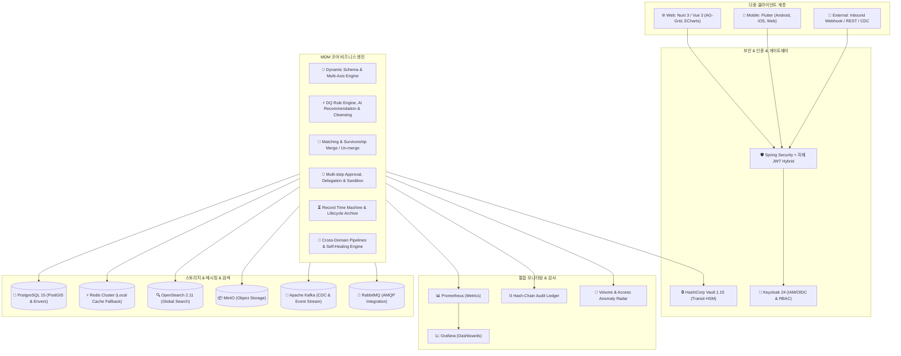

# 🏢 Master Data Management (MDM) Enterprise Platform

조직 내 파편화된 마스터 데이터(Master Data)를 통합·정제·거버넌스하고, 불변 감사 원장과 AI 자율 치유 파이프라인을 통해 전사 단일 진실 공급원(**Single Source of Truth, Golden Record**)을 구축하는 엔터프라이즈급 MDM 플랫폼입니다.

---

## 🎯 Platform Vision & Overview

본 플랫폼은 동적 스키마(Dynamic Schema) 엔진을 기반으로 시작하여, 엔터프라이즈 데이터 거버넌스, AI 기반 데이터 품질(DQ) 자율 정제, 블록체인형 해시체인 감사 원장, CDC 실시간 스트리밍, HashiCorp Vault Transit 암호화, 다중 리전 및 멀티 테넌트 아키텍처를 아우르는 **차세대 엔터프라이즈 마스터 데이터 관리(MDM) 생태계**로 완성되었습니다.



---

## 🛠 Tech Stack

| 영역 | 기술 / 프레임워크 | 세부 설명 및 버전 |
|---|---|---|
| **Backend** | **Spring Boot 4.1.0 (Java 17)** | Maven Artifact `1.2.47`, Spring Data JPA, Spring Data Envers, Spring Integration, Spring Kafka, Spring AMQP, Spring Retry |
| **Security & Enc** | **Keycloak 24 + Vault 1.15** | OIDC/RBAC, 2FA/OTP (TOTP/Email OTP/Backup Codes), 32바이트 AES 하이브리드 암호화, SHA-256 HMAC Blind Indexing, Vault Transit HSM |
| **Frontend** | **Nuxt 3 (^3.21.11) + Vue 3** | 버전 `1.5.76`, TypeScript (^5.9.3), Vuestic UI, AG-Grid Vue3 (^34.3.1 Community 가상스크롤 & 무한 서버사이드 페이징), ECharts, STOMP, Tiptap 에디터 |
| **Mobile** | **Flutter 3.x (Dart)** | Riverpod (상태관리), GoRouter, Dio (타임존/보안 인터셉터), STOMP 실시간 채팅, 2FA 모바일 로그인, Web/iOS/Android |
| **Database & Cache** | **PostgreSQL 15 + Redis** | PostGIS 공간 지원, JSONB 메타데이터, 분산 캐시 & Local In-Memory Fallback |
| **Storage & Search** | **MinIO + OpenSearch 2.11** | S3 호환 오브젝트 스토리지, 다차원 형태소 분석 및 전역 전문 검색 엔진 |
| **Messaging** | **Kafka + RabbitMQ** | 실시간 CDC 변경 스트리밍, 비동기 배치, 아웃바운드 연계 큐 |
| **Monitoring** | **Prometheus + Grafana** | Micrometer 기반 JVM/HTTP/DB 커넥션풀 메트릭 수집 및 시각화 대시보드 |
| **DevOps & Infra** | **Kubernetes & Docker** | 19종 k8s 매니페스트 (Replicas: 2 무중단 롤링 업데이트), Let's Encrypt SSL 자동 갱신, 공인 도메인(`mdm.mplat.store`), 초고속 단독 배포 파이프라인 |
| **Public Domain** | **`https://mdm.mplat.store`** | 가비아 DNS + Let's Encrypt 자동 갱신 TLS Ingress 라우팅 완비 |

---

## 🔑 Key Features (핵심 기능)

### 1. 🧩 동적 도메인 & 다축 분류체계 (Dynamic Schema & Multi-Axis Classification)
- **런타임 메타데이터 드리븐 스키마**: 테이블 DDL 변경 없이 `Domain` → `ClassificationAxis` → `ClassificationNode` → `FieldDefinition`을 런타임에 동적으로 구성.
- **다축 분류(Multi-Axis)**: 단일 트리 계층을 넘어 조직 축, 직군 축, 품목 축 등 다중 축을 생성하고 레코드를 다대다 서브 매핑(`RecordSecondaryNode`).
- **필드 상속 & 캐싱**: 상위 노드 필드가 하위 노드로 자동 상속되며, 유효 필드 수집 결과(`getEffectiveFields`)를 Redis/Local 이중 캐시로 최적화.

### 2. ⚡ 데이터 품질(DQ), AI 추천 & 자율 치유 (Autonomous Data Cleansing)
- **10종 룰 엔진**: `NOT_NULL`, `REGEX`, `RANGE`, `LENGTH`, `ENUM`, `DATE_RANGE`, `CROSS_FIELD`, `UNIQUE`, `SPEL_EXPRESSION`, `CALCULATED_FIELD`.
- **AI 룰 자동 추천 (`DqRecommendationService`)**: 데이터 프로파일링 통계를 기반으로 최적의 DQ 검증 규칙을 AI가 자동 탐지 및 추천.
- **자율 정제 및 치료 (`DqRemediationService`, `AutonomousCleansingService`)**: 위반 데이터에 대해 교정 제안을 생성하고 원클릭 자동 치유 수행.
- **시계열 품질 트렌드 (`DqScoreSnapshot`)**: 일일 크론 스캔 및 수동 스캔 결과를 시계열로 보관하여 품질 변화 추이 차트 제공.
- **Excel 대량 업로드 사전 검증**: 저장 전 행 단위 위반 사항(필드, 사유, 입력값)을 사전 리포트(`POST /records/batch-validate`).

### 3. 🎯 매칭, 골든 레코드(Golden Record) & Un-merge
- **퍼지/정확 매칭**: Jaro-Winkler 유사도 알고리즘 기반 중복 레코드 자동 탐지.
- **스튜어드 피드백 루프 (`MatchFeedbackService`)**: 스튜어드의 검토(확정/반려) 이력을 학습하여 매칭 룰 정밀도 및 권장 임계값 산출.
- **서바이버십(Survivorship) 병합 & Un-merge**: 소스 시스템 우선순위(`SourcePriority`) 기반 필드 단위 병합 및 오병합 복원(`POST /records/{id}/unmerge`).

### 4. 📜 결재 워크플로우, 위임, 샌드박스 & 에스컬레이션
- **다단계 결재선 & 관리자 개입**: 부서/직급/역할 기반 결재선 및 최고 관리자 강제 승인/반려.
- **결재 위임 (`ApprovalDelegationService`)**: 부재 시 대결자 지정 및 위임 기간 설정.
- **결재 에스컬레이션 (`ApprovalEscalationService`)**: 결재 지연 시 상위 승인권자 자동 승격.
- **동적 라우팅 템플릿 (`DynamicRoutingService`)**: 금액/속성 조건에 따라 결재 경로 자동 분기.
- **결재 샌드박스 시뮬레이션 (`ApprovalSandboxService`)**: 승인 시 변경 사항이 시스템에 미치는 영향을 사전 시뮬레이션.
- **반려 원인 분석 (`RejectionAnalyticsService`)**: 결재 반려 패턴 및 사유 통계 분석.

### 5. 🔒 제로 트러스트 보안, Vault Transit & 해시체인 불변 감사
- **32바이트 AES 하이브리드 암호화 & SHA-256 HMAC Blind Index**: 원본 노출 없는 일치 검색 보장.
- **HashiCorp Vault Transit 연동**: 하드웨어 보안 모듈(HSM) 및 Vault 키 기반 암호화 지원.
- **개인정보 동적 마스킹 & 감사 로그 (`SensitiveDataAccessLog`)**: 주민번호, 전화번호 마스킹 및 열람 사유 강제 기록.
- **해시체인 감사 원장 (`HashChainAuditService`)**: 블록체인 방식의 SHA-256 해시 체인을 통해 레코드 변경 이력의 위변조 방지.
- **규제 컴플라이언스 (`RegulatoryComplianceService`)**: GDPR, 개인정보보호법 준수 현황 리포트.

### 6. 🔗 엔터프라이즈 연계, CDC 스트리밍 & 자가 치유 파이프라인
- **인바운드 & 아웃바운드**: HTTP Webhook, JDBC Direct SQL, Kafka, RabbitMQ 지원.
- **지수 백오프 & Dead-Letter Queue (DLQ)**: 오류 시 지수 백오프 자동 재시도 및 DLQ 격리, 일괄 재시도 API.
- **CDC 스트리밍 (`CdcStreamingService`)**: Debezium/Kafka 기반 실시간 마스터 데이터 변경 이벤트 스트림.
- **파이프라인 자가 치유 (`PipelineSelfHealingService`)**: 연계 파이프라인 장애 감지 시 자동 우회 및 복구.
- **스마트 AI 매핑 (`SmartMappingService`)**: 외부 스키마와 내부 메타데이터 간 자동 매핑 추천.

### 7. ⏳ 데이터 라이프사이클 & 타임머신
- **레코드 타임머신 (`RecordTimeMachineService`)**: 과거 특정 시점(As-Of)의 레코드 상태 스냅샷 조회 및 롤백.
- **콜드 스토리지 아카이빙 (`ColdStorageArchiveService`)**: 장기 미사용 레코드 MinIO/S3 압축 보관 및 복원.
- **데이터 보존 정책 (`DataRetentionPolicyService`)**: 법적 보존 기한 경과 데이터 자동 파기/격리.
- **참조 무결성 (`ReferenceIntegrityService`)**: 도메인 간 마스터 참조 링크 자동 검사.
- **데이터 신선도 히트맵 & SLA 계약 (`DataFreshnessHeatmapService`, `DataSlaContractService`)**.

### 8. 🧠 지능형 AI, 비즈니스 용어사전 & 온톨로지
- **자연어 스마트 쿼리 (`SmartQueryParserService`)**: 자연어 질의를 파싱하여 복합 조건 검색 수행.
- **비정형 데이터 추출 (`UnstructuredDataExtractorService`)**: 비정형 텍스트/문서에서 마스터 필드 자동 추출.
- **비즈니스 용어사전 (Business Glossary)**: 표준 용어 정의 및 도메인 필드 양방향 매핑.
- **시맨틱 온톨로지 (`SemanticOntologyService`)**: 마스터 데이터 간 관계를 온톨로지 그래프로 모델링.
- **거버넌스 AI 코파일럿 (`GovernanceCopilotService`)**: 거버넌스 정책 및 스키마 질의응답.

### 9. 🌐 고성능 협업 워크스페이스 & 크로스플랫폼 모바일
- **Nuxt 3 반응형 웹 콘솔**: AG-Grid Vue3 (v34+ Community 가상스크롤 & 무한 서버사이드 페이징), ECharts, Zero-Fallback `@nuxtjs/i18n`, 개인화 타임존 지원.
- **8방향 리사이즈 인앱 메신저**: 실시간 웹소켓 채팅, 원클릭 다국어 번역, 대화형 엑셀/테이블 뷰어, 시스템 라디오.
- **Flutter 모바일 앱**: 결재 승인/반려, 대시보드, 레코드 탐색, 2FA 다중인증, 인앱 채팅, 실시간 푸시 알림.

### 10. 🔐 로그인 이중화 (2FA / OTP 다중인증)
- **RFC 6238 TOTP**: Google Authenticator 등 OTP 앱 연동 및 시간 윈도우 오차 보정.
- **이메일 OTP & 긴급 백업코드**: 메일 서버 연동 일회용 인증코드(TTL 5분) 및 비상 복구용 8자리 SHA-256 일회용 백업코드 8회분 발급.
- **프론트엔드 통합 모달**: 로그인 시 2FA 활성화 계정에 대해 즉시 2단계 검증 모달 트리거.

### 11. 🚀 B2B 셀프 온보딩 & 맞춤 템플릿 프로비저닝
- **소개 랜딩 페이지 & 라우팅 분기**: 비로그인 방문자 대상 인터랙티브 소개 페이지(`pages/index.vue`) 제공 및 로그인 상태별 자동 대시보드 이동.
- **B2B 셀프서비스 가입 퍼널 (`pages/register.vue`)**: 회사 정보 입력 및 업종별 맞춤 도메인 템플릿(부동산 임대차, 고객, 상품 등) 선택.
- **원클릭 자동 프로비저닝**: 트랜잭션 단위로 기본 도메인, 노드 트리, 필드 정의 및 초기 샘플 데이터 일괄 생성.
- **MDM ROI 계산기 (`pages/roi-calculator.vue`)**: 데이터 오류 비용 및 인건비 절감 시뮬레이션 리드마그넷.

### 12. 🏢 부동산 임대차 (`LEASE_CONTRACT`) 리스크 대시보드 위젯
- **임대차 마스터 도메인 템플릿**: 보증금, 월세, 임대인/임차인, 계약만기일, 납부상태 등 전문 필드 메타데이터 완비.
- **만기 & 연체 리스크 위젯**: 만기 임박(D-30, D-7) 계약 및 월세 연체 상태를 실시간 스캔하여 대시보드 리스크 패널에 시각화.

### 13. 🗺️ 레코드 데이터 계보 (Data Lineage) 5단계 파이프라인 시각화
- **전 구간 5단계 계보 추적**: Source Ingestion → DQ Validation → Data Cleansing → Golden Record Merge → Target Egress.
- **대화형 파이프라인 그래프**: 노드 클릭 시 단계별 적용 룰, 변경 전후 데이터 Diff, 변환 시간 및 이상 노드 경고 실시간 표출.

### 14. 🛡️ RBAC 세분화 & 컬럼 수준 동적 마스킹 정책
- **도메인 및 노드별 데이터 스코프**: 사용자의 부서/역할에 따라 특정 도메인 및 분류 노드 하위 레코드만 접근 허용.
- **컬럼 수준 동적 마스킹**: 비인가 역할에 대해 민감 컬럼(주민등록번호, 계좌번호, 급여 등)을 `***`로 런타임 동적 마스킹.

### 15. 📐 스키마 변경 히스토리 및 하위호환성 사전 시뮬레이션
- **Breaking Change 가드**: 필수 필드 추가, 기존 타입 축소, Enum 값 삭제 등 하위호환성 파괴 시 사전 경고.
- **시뮬레이션 엔진**: 기존 레코드에 변경 스키마를 사전 검증하여 비호환 레코드 건수 및 영향도 리포트 제공.

### 16. 📈 DQ 크로스도메인 벤치마크 & 메트릭 비교
- **전사 도메인 품질 비교**: 도메인별 DQ 종합 점수를 레이더 차트 및 랭킹 테이블로 제공.
- **공통 규칙 통계**: NOT_NULL, UNIQUE 등 주요 규칙별 준수율을 크로스 분석하여 취약 도메인 조기 식별.

### 17. 📥 마스터 레코드 대량 임포트 동적 템플릿 & 오류 리포트
- **동적 엑셀/CSV 템플릿**: 도메인 필드 메타데이터(타입, 필수여부, Enum 목록)가 주석/드롭다운으로 포함된 템플릿 즉시 생성.
- **행/열 단위 사전 검증 리포트**: 업로드 시 위반 행 번호, 필드명, 위반 사유를 정밀 리포트하고 오류 행만 분리 재다운로드 지원.

---

## 🏗 Infrastructure Services (Docker Compose)

| 서비스 | 컨테이너명 | 기본 포트 | 용도 |
|---|---|---|---|
| **PostgreSQL 15** | `mdm_postgres` | `5432` | 메인 RDBMS (PostGIS, Envers) |
| **OpenSearch 2.11** | `mdm_opensearch` | `9200, 9600` | 분산 전문 검색 엔진 |
| **MinIO** | `mdm_minio` | `9000, 9001` | S3 호환 오브젝트 스토리지 |
| **Keycloak 24** | `mdm_keycloak` | `8081` | IAM / OIDC 인증 서버 |
| **HashiCorp Vault 1.15** | `mdm_vault` | `8200` | Transit 암호화 엔진 |
| **Redis** | `mdm_redis` | `6379` | 분산 캐시 (Local Cache Fallback) |
| **RabbitMQ 3** | `mdm_rabbitmq` | `5672, 15672` | AMQP 메시지 브로커 |
| **Kafka + Zookeeper** | `mdm_kafka` | `9092, 2181` | CDC 및 이벤트 스트리밍 |
| **Prometheus** | `mdm_prometheus` | `9090` | 메트릭 수집 엔진 |
| **Grafana** | `mdm_grafana` | `3005` | 통합 모니터링 대시보드 |

---

## 🚀 Quick Start Guide

### 1. 환경 변수 설정
```bash
cp .env.example .env
```

### 2. 인프라 서비스 구동 (Docker Compose)
```bash
docker-compose up -d
```
> **참고:** Keycloak은 `./keycloak/realm-export.json`을 자동 임포트하며, Vault는 `./init-vault.sh`를 통해 Transit 엔진을 자동 초기화할 수 있습니다.

### 3. 백엔드 구동 (Spring Boot)
```bash
cd backend
export DB_USERNAME="postgres"
export DB_PASSWORD="your_postgres_password"
export JWT_SECRET="your_jwt_secret_key_which_must_be_at_least_256_bits_long_for_hs256_security"
export OAUTH2_ISSUER_URI="http://localhost:8081/realms/mplatform"
./mvnw clean spring-boot:run
```

### 4. 프론트엔드 구동 (Nuxt 3)
```bash
cd frontend
npm install
npm run dev
```
- 브라우저 접속: `http://localhost:3000`

### 5. 모바일 앱 구동 (Flutter)
```bash
cd mobile
flutter pub get
flutter run
```

---

## 📄 Documentation Sitemap (기술 명세서)

`spac/` 디렉토리 내에 분야별 상세 엔지니어링 명세서가 완비되어 있습니다.

| 번호 | 문서 파일 | 주요 내용 |
|:---:|---|---|
| **1** | [`1_overview.md`](./spac/1_overview.md) | MDM 플랫폼 아키텍처 개요, 12대 핵심 개념, 최신 실측 메트릭 및 도메인 모델 원칙 |
| **2** | [`2_data_model.md`](./spac/2_data_model.md) | PostgreSQL 77개 엔티티 스키마, 2FA/온보딩/계보/RBAC 마스킹 데이터 모델 명세 |
| **3** | [`3_business_logic.md`](./spac/3_business_logic.md) | 2FA/OTP 알고리즘, 온보딩 프로비저닝, ROI 수식, 임대차 리스크, 5단계 계보 그래프 로직 |
| **4** | [`4_api_spec.md`](./spac/4_api_spec.md) | 97개 컨트롤러의 REST API & WebSocket 엔드포인트 전수 명세 |
| **5** | [`5_scenarios_and_erd.md`](./spac/5_scenarios_and_erd.md) | 통합 Mermaid ERD 다이어그램 및 20대 엔드투엔드 실무 운영 시나리오 |
| **6** | [`6_governance.md`](./spac/6_governance.md) | 5단계 계보 거버넌스, 컬럼 수준 마스킹, 스키마 호환성 사전 시뮬레이션 규약 |
| **7** | [`7_integration_feature_spec.md`](./spac/7_integration_feature_spec.md) | Inbound/Outbound, DLQ 백오프, CDC 스트리밍, 대량 임포트 템플릿/검증 리포트 명세 |
| **8** | [`8_platform_features.md`](./spac/8_platform_features.md) | AG-Grid 대용량 가상스크롤/서버사이드 페이징, Vault 암호화, 이상 탐지, SLA 계약 명세 |
| **9** | [`9_mobile_architecture.md`](./spac/9_mobile_architecture.md) | Flutter 모바일 앱 아키텍처, 2FA 로그인, 임대차 리스크 알림, Nginx 웹 배포 명세 |
| **10** | [`10_infrastructure_and_deployment.md`](./spac/10_infrastructure_and_deployment.md) | K8s 19종 매니페스트, Replicas: 2 무중단 롤링, 공인 도메인, SSL 자동 갱신, 초고속 배포 |

---

## 🐳 Docker Build & Publish Pipeline (도커 배포 파이프라인)

백엔드, 프론트엔드, 모바일 3개 서비스를 원클릭으로 빌드하고 Docker Registry에 배포할 수 있는 초고속 독립 배포 파이프라인이 구축되어 있습니다.

### 1. 모듈별 초고속 단독 배포 (Standard Deployment)
변경사항이 있는 모듈만 개별적으로 버전을 올리고 호스트 사전 빌드 산출물을 복사하여 초고속으로 배포합니다.
```bash
# ① 프론트엔드 단독 배포 (~20초 파이프라인)
./deploy-frontend.sh

# ② 백엔드 단독 배포 (~15초 파이프라인)
./deploy-backend.sh
```

### 2. 전체 시스템 통합 배포 (Bash)
```bash
# 전체 인프라 및 서비스 일괄 배포
./deploy.sh

# 레지스트리 및 태그 지정 배포
./deploy.sh ghcr.io/myorg v1.2.47
```

### 3. 도커 이미지 빌드 및 퍼블리시 (Multi-Service Publish)
```bash
# 전체 서비스 빌드 및 푸시
./publish-docker.sh ghcr.io/myorg v1.2.47 all

# 특정 서비스만 빌드 및 푸시
./publish-docker.sh ghcr.io/myorg v1.5.76 frontend

# 푸시 없이 로컬 도커 이미지로만 빌드
./publish-docker.sh mplatform local-test all --no-push
```

### 4. GitHub Actions 자동 퍼블리시 (`.github/workflows/docker-publish.yml`)
- **릴리즈 배포**: GitHub Release가 게시되거나 `v*.*.*` 태그 푸시 시 3개 서비스가 자동으로 GitHub Container Registry(GHCR)에 빌드 & 푸시됩니다.
- **수동 배포**: GitHub Actions 탭에서 `Build & Publish Docker Images` 워크플로우를 선택 후 버전 태그 및 빌드 대상(all / backend / frontend / mobile)을 지정하여 즉시 배포할 수 있습니다.

---

## 🧪 Testing & TDD Quality Pipeline

본 프로젝트는 사이드 이펙트 방지 및 런타임 무결성을 위해 **프론트엔드와 백엔드 모두 TDD 기반 검증 체계**를 운영합니다.

- **Backend (JUnit 5 & Golden Sample)**:
  - **253개**의 단위/통합 테스트 스펙 운영.
  - `FieldEncryptionServiceTest`의 고정 암호문(Golden Sample) 회귀 검증을 통해 암호화 역방향 호환성 100% 보장.
  ```bash
  cd backend
  ./mvnw test
  ```
- **Frontend (Vitest & Nuxt AST Static Compile)**:
  - **243개**의 단위/컴포넌트 테스트 스펙 운영.
  - `npm test` 구동 시 Vitest 유닛 테스트와 `npm run build`(Nuxt 정적 컴파일 검증)를 결합하여 Vue AST 및 SSR 호환성 사전 검증.
  ```bash
  cd frontend
  npm test
  ```

---

## 🌐 주요 REST API 요약 (Base URL: `/api`)

| 구분 | Endpoint | Method | 설명 |
|---|---|:---:|---|
| **도메인/스키마** | `/domains` | `GET, POST` | 도메인 CRUD 및 루트 필드 관리 |
| **도메인/스키마** | `/domains/{id}` | `GET, PUT, DELETE` | 도메인 상세 조회, 수정, Cascade 삭제 |
| **다축 분류** | `/domains/{domainId}/axes` | `GET, POST` | 다축 분류체계 CRUD 및 노드 매핑 |
| **레코드/다축** | `/records/{id}/secondary-nodes` | `GET, POST` | 레코드 서브 분류축 노드 등록/조회 |
| **Excel 대량 임포트** | `/records/bulk-import/template` | `GET` | 도메인 맞춤형 대량 임포트 엑셀 템플릿 다운로드 |
| **Excel 사전검증** | `/nodes/{nodeId}/records/batch-validate` | `POST` | 대량 업로드 행 단위 DQ 사전 검증 및 오류 리포트 |
| **2FA / OTP 인증** | `/auth/2fa/setup`, `/auth/2fa/verify` | `POST` | TOTP 시크릿 발급, QR 검증 및 2FA 활성화 |
| **2FA 이메일/백업** | `/auth/2fa/email-otp/send`, `/auth/2fa/backup-codes` | `POST` | 이메일 OTP 발송 및 일회용 긴급 백업코드 관리 |
| **B2B 온보딩** | `/auth/signup`, `/onboarding/provision` | `POST` | B2B 회원가입 및 업종별 맞춤 도메인 자동 프로비저닝 |
| **MDM ROI 계산** | `/lead-magnet/roi-calculate`, `/lead-magnet/submit` | `POST` | 데이터 오류 비용 절감 계산 및 리드 수집 |
| **임대차 리스크** | `/dashboard/lease-contract/risks` | `GET` | 부동산 임대차 만기(D-30/D-7) 및 월세 연체 리스크 위젯 |
| **데이터 계보** | `/records/{id}/pipeline-lineage` | `GET` | Ingestion부터 Golden Record까지 5단계 계보 파이프라인 그래프 |
| **RBAC 스코프** | `/permissions/scopes`, `/permissions/column-masking` | `GET, PUT` | 도메인/노드 접근 스코프 및 컬럼 마스킹 규칙 관리 |
| **스키마 호환성** | `/domains/{id}/schema-history/simulate` | `POST` | 스키마 변경 시 하위호환성 사전 시뮬레이션 |
| **DQ 벤치마크** | `/dq/benchmarks/cross-domain` | `GET` | 전사 도메인 간 종합 품질 점수 벤치마크 및 비교 |
| **결재 워크플로우** | `/approval-requests/todos` | `GET` | 내 결재 대기 목록 조회 |
| **결재 위임/에스컬레이션** | `/approvals/delegations`, `/approvals/escalate` | `GET, POST` | 결재 위임 설정 및 SLA 에스컬레이션 |
| **결재 샌드박스** | `/approvals/{requestId}/sandbox-preview` | `POST` | 결재 승인 전 사전 영향 시뮬레이션 |
| **DQ 시계열 트렌드** | `/domains/{domainId}/dq-score/trend` | `GET` | DQ 점수 시계열 변화 추이 조회 |
| **DQ 자율 치료/정제** | `/domains/{domainId}/dq/cleansing-proposals` | `GET, POST` | AI 기반 자율 정제 제안 및 일괄 교정 |
| **Golden Record / Unmerge** | `/records/{id}/unmerge` | `POST` | 병합 레코드 원복 복원 |
| **해시체인 원장** | `/records/{recordId}/ledger` | `GET` | 블록체인형 불변 감사 원장 검증 조회 |
| **레코드 타임머신** | `/records/{recordId}/timemachine` | `GET, POST` | 과거 특정 시점 조회 및 상태 롤백 |
| **연계 & DLQ** | `/admin/integration/logs/dead-letter` | `GET, POST` | DLQ 목록 조회 및 일괄 재시도 |
| **CDC 스트리밍** | `/domains/{domainId}/cdc` | `GET, POST` | CDC 실시간 변경 이벤트 스트림 제어 |
| **스마트 자연어 검색** | `/domains/{domainId}/smart-query` | `POST` | 자연어 질의 기반 스마트 레코드 검색 |
| **비정형 데이터 추출** | `/domains/{domainId}/ai/extract-unstructured` | `POST` | 비정형 문서에서 마스터 필드 추출 |
| **비즈니스 용어사전** | `/business-terms` | `GET, POST` | 전사 비즈니스 용어사전 및 필드 매핑 |
| **글로벌 시스템 진단** | `/system/diagnostics` | `GET` | CPU, Memory, DB Pool, Queue 통합 진단 |
| **이상 탐지 레이더** | `/system/volume-radar`, `/security/anomaly-detection` | `GET` | 대량 변동 및 이상 접근 탐지 |

---

## 📖 시스템 운영 가이드 및 OpenAPI (Swagger UI)
- **공식 엔터프라이즈 운영 매뉴얼**: [`docs/OPERATION_GUIDE.md`](./docs/OPERATION_GUIDE.md) (13대 미들웨어 운영, 백업/DR, 키 로테이션, 장애 대응 SOP)
- **공인 도메인 Swagger UI**: [`https://mdm.mplat.store/api/swagger-ui.html`](https://mdm.mplat.store/api/swagger-ui.html) (로컬: `http://localhost:8080/api/swagger-ui.html`)
- **OpenAPI v3 JSON 명세**: [`https://mdm.mplat.store/api/v3/api-docs`](https://mdm.mplat.store/api/v3/api-docs)

---

## 🤝 Contributing & License
- 프로젝트 기여 가이드 및 개발 표준 규약: [`CONTRIBUTING.md`](./CONTRIBUTING.md)
- 라이선스: [MIT License](./LICENSE)

