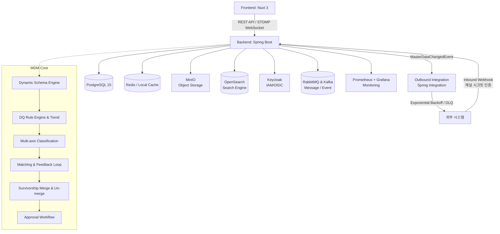

# Master Data Management (MDM) System

이 프로젝트는 조직 내 흩어진 핵심 데이터(Master Data)를 통합, 정제, 일관성 있게 관리하기 위한 Domain / Master Data Management(MDM) 시스템입니다.

## 🎯 Project Purpose (프로젝트 전체 목표)
초기에는 각 부서나 시스템별로 파편화된 **Domain Management** 기능을 제공하여 개별 데이터를 관리하는 수준에서 시작했습니다. 하지만 궁극적인 목표는 **Master Data Management(MDM) 플랫폼으로의 진화**입니다.
기업의 핵심 데이터인 Customer, Product, Vendor, Employee 등의 마스터 데이터를 중앙 집중식으로 수집하고, 데이터 품질(Data Quality)을 검증하여, 중복을 제거한 **Golden Record**를 생성하고 이를 외부 시스템으로 전파하는 것을 목표로 합니다.

> **현재 상태:** 동적 스키마(승인 워크플로우 포함), DQ 룰 엔진(실시간 차단 + 정기 스캔 + 시계열 트렌드), 정확/퍼지(유사도) 중복 검사 및 스튜어드 피드백 루프, 소스 우선순위 기반 필드 단위 병합(Survivorship) 및 Un-merge(병합 해제), 다축 분류체계(Multi-axis Classification), Excel 대량 업로드 사전 검증 리포트, 인바운드/아웃바운드 지수 백오프 및 Dead-Letter Queue(DLQ) 연계까지 완벽하게 구현되어 있습니다. 세부 내용은 [🔑 Key Features](#-key-features) 참고.

> [!WARNING]
> **🚨 쿠버네티스(Kubernetes) 관련 작업 시 주의사항**
> K8s 관련 배포 매니페스트 및 설정 파일들은 프로젝트 최상단의 `k8s/` 폴더 내에 이미 완벽하게 구성되어 있습니다.
> 쿠버네티스 구동 및 수정 작업 시에는 **반드시 `k8s/` 폴더 내의 파일들을 확인하고 작업**하시기 바랍니다. 임의로 새로운 매니페스트를 만들거나 덮어쓰지 마세요!
## 🏛 Architecture Overview
Frontend와 Backend가 완전히 분리된 구조로 REST API를 통해 통신하며, 런타임에 동적으로 스키마를 구성하는 메타데이터 드리븐 아키텍처를 채택했습니다.



> **보안 및 인프라 안내:** 
> - 백엔드는 Spring Security 기반 자체 JWT 토큰 인증 방식을 사용합니다.
> - `application.yml`은 `JWT_SECRET`, `DB_USERNAME`, `DB_PASSWORD` 등 환경변수를 필수로 참조합니다.
> - Redis 미설치 환경에서는 `LocalCacheConfig`를 통해 인메모리 캐시로 자동 전환됩니다.

## 🛠 Tech Stack 상세
- **Frontend**
  - **Framework**: Nuxt 3 (^3.17.7), Vue 3 (SSR 및 `defineAsyncComponent`/`<ClientOnly>` 기반 브라우저 API 안전 격리)
  - **Language**: TypeScript (^5.9.3)
  - **UI Library**: Vuestic UI (^1.10.3)
  - **Data Grid & Chart**: AG Grid Vue3 / Enterprise (^34.3.1, v32+ 현대적 객체 구문 전환 및 서버 사이드 페이징 지원), Apache ECharts (^5.6.0)
  - **WebSocket**: STOMP (`@stomp/stompjs`) 실시간 통신
  - **i18n**: `@nuxtjs/i18n` 기반 **Zero-Fallback 다국어 구조** (하드코딩 및 런타임 문자열 폴백 원천 방지, 100% 사전 검증 체계 적용)
  - **E2E Testing**: Playwright E2E 테스트
- **Backend**
  - **Framework**: Spring Boot 4.1.0 (`prod` 프로필 PostgreSQL `ddl-auto: validate` 및 멱등성 데이터 초기화 보장)
  - **Language**: Java 17
  - **ORM & Encryption**: Spring Data JPA, Hibernate, Spring Data Envers, **32바이트 AES 하이브리드 암호화 & SHA-256 HMAC Blind Indexing**
  - **Security**: Keycloak OIDC + 자체 JWT 이중 인증 (하이브리드 모드), OAuth2 Resource Server 연동
  - **Integration**: Spring Integration, Spring Retry, Spring Kafka, Spring AMQP(RabbitMQ) — 아웃바운드 연계 채널용
  - **Clients & Utils**: MinIO SDK, OpenSearch Client, Keycloak Admin Client, Apache POI (엑셀 처리)
  - **WebSocket**: STOMP 메시징
  - **Monitoring**: Micrometer + Prometheus (메트릭)
- **Database & Infrastructure**
  - **RDBMS**: PostgreSQL 15
  - **Cache**: Redis / Spring Cache (`@Cacheable`, `@CacheEvict`) — Redis 장애 시 Local ConcurrentMap으로 자동 폴백
  - **Container**: Docker & Docker Compose

## 🏗 Infrastructure Services (Docker Compose)
- **PostgreSQL 15 (PostGIS)** - 메인 RDBMS
- **Keycloak 24** - IAM/OIDC 인증 (Realm: mplatform, Roles: SYSTEM_ADMIN, DOMAIN_ADMIN, DATA_STEWARD, VIEWER)
- **OpenSearch 2.11** - 전문 검색 엔진
- **MinIO** - 오브젝트 스토리지 (파일 첨부)
- **Redis** - 분산 캐시 (Fallback: In-Memory)
- **RabbitMQ 3** - AMQP 메시지 브로커
- **Kafka + Zookeeper** - 이벤트 스트리밍
- **Prometheus + Grafana** - 시스템 모니터링 (JVM, HTTP Latency, DB Pool)

## 🚀 Quick Start

### 1. 환경 변수 설정
최상위 디렉토리의 `.env.example`을 복사하여 `.env` 파일을 작성합니다.
```bash
cp .env.example .env
```

### 2. 인프라 실행 (Docker Compose)
Docker Compose를 통해 필요한 모든 인프라(Keycloak 등)가 실행됩니다. (Keycloak은 `realm-export.json`이 자동 임포트됨)
```bash
docker-compose up -d
```

### 3. 백엔드 서버 구동
```bash
cd backend
export JWT_SECRET="your_jwt_secret_key_which_must_be_at_least_256_bits_long_for_hs256_security"
export DB_USERNAME="postgres"
export DB_PASSWORD="your_postgres_password_here"
export OAUTH2_ISSUER_URI="http://localhost:8081/realms/mplatform"
./mvnw clean spring-boot:run
```

### 4. 프론트엔드 서버 구동
```bash
cd frontend
npm install
npm run dev
```

### 5. 모바일 앱 구동
```bash
cd mobile
flutter pub get
flutter run
```

## 📱 Mobile App
모바일 앱 (mobile/ 디렉토리) 프론트엔드 구성 요소:
- **Framework**: Flutter (Android, iOS, Web 크로스플랫폼)
- **State Management**: Riverpod
- **Router**: GoRouter
- **HTTP Client**: Dio (인증/타임존 인터셉터)
- **WebSocket**: STOMP (실시간 채팅)
- **Features**: 대시보드, 레코드 조회, 결재 승인/반려, DQ 현황, 실시간 채팅, 알림, 전역 검색
- **Architecture**: Feature-first 모듈형 구조

## 🔑 Key Features

**[핵심 구현 완료 기능]**
- **Dynamic Domain / Schema Engine**: 하드코딩된 테이블 스키마 없이 Domain → Classification Node(트리, 필드 상속) → FieldGroup/Sector → FieldDefinition을 런타임에 동적으로 구성.
- **다축 분류체계 (Multi-axis Classification)**: 단일 트리 구조를 넘어, 도메인별 다중 분류축(분류체계 버전 관리 및 스냅샷 포함) 관리 및 레코드 서브 노드 매핑 지원.
- **Data Quality Rule Engine & 시계열 트렌드**: AI 기반 DQ 룰 추천, 데이터 프로파일링, NotNull, Regex, Range, Length, Enum, DateRange, CrossField, Unique, SpEL 수식 검증. 실시간 차단 + 정기 스캔 + 시계열 트렌드.
- **Excel 대량 업로드 사전 검증 리포트**: Excel 파일 업로드 시 `POST /records/batch-validate` 사전 검증을 거쳐, 행별 위반 필드·사유·입력값을 표로 리포팅.
- **Matching / 중복 검사 & 피드백 루프**: 정확(EXACT) 및 퍼지(FUZZY) 매칭. 스튜어드의 매칭 검토 이력을 통한 피드백 루프.
- **Golden Record 병합 & Un-merge (병합 해제)**: 소스 시스템 우선순위 기반 필드 단위 서바이버십 병합. 잘못 병합된 레코드를 복원하는 Un-merge API 지원.
- **개인정보 마스킹 및 강력한 암호화**: 하이브리드 암호화 아키텍처 및 마스킹.
- **연계(Integration) 지수 백오프 & Dead-Letter Queue (DLQ)**: 연계 실패 시 지수 백오프 자동 재시도, 수동/일괄 재시도 API 제공.
- **EffectiveFields 캐싱 & 스키마 무효화**: 유효 필드 수집 결과 캐싱 및 스키마 변경 시 자동 무효화.
- **Record 승인 워크플로우 & 감사(Audit)**: 레코드 다단계 결재, 스키마 영향도 분석.
- **시스템 설치 위저드**: 초기 구성 자동화 및 멱등성(Idempotence) 기반 시드 데이터 초기화.
- **전역 통합 검색**: OpenSearch 연동을 통한 다중 필드 조합 전문 검색 엔진.
- **파일 관리**: MinIO 오브젝트 스토리지 연동 첨부파일 관리.
- **조직/부서 및 권한 관리**: 동적 메뉴 트리, 역할 기반 권한 필터링 및 도메인별 권한 관리 (Permission Matrix). 조직/부서 트리 관리.
- **마스터 데이터 간 관계 정의 (Master Relation)**: 도메인 간 마스터 데이터 관계 관리.
- **자동 채번 (Numbering Service)**: 규칙 기반 채번 서비스.
- **실시간 통신 & 모니터링**: STOMP WebSocket 기반 인앱 실시간 채팅 시스템 및 SSE+WebSocket 기반 실시간 시스템 알림. Prometheus + Grafana 모니터링 대시보드.
- **공통 코드 관리**: 다국어 지원 공통 코드 체계.

## 📄 Spec Documents
`spac/` 디렉토리 내에 상세 기술 명세서가 제공됩니다.
| 번호 | 문서 | 내용 |
|---|---|---|
| 1 | `1_overview.md` | 프로젝트 개요 및 핵심 개념 정의 |
| 2 | `2_data_model.md` | PostgreSQL 데이터 스키마 명세 |
| 3 | `3_business_logic.md` | 비즈니스 로직 및 알고리즘 스펙 |
| 4 | `4_api_spec.md` | REST API 엔드포인트 명세 |
| 5 | `5_scenarios_and_erd.md` | ERD 및 운영 시나리오 |
| 6 | `6_governance.md` | 거버넌스 및 스키마 감사 |
| 7 | `7_integration_feature_spec.md` | 외부 연계 및 DLQ 명세 |
| 8 | `8_platform_features.md` | 플랫폼 성능, 캐싱, 보안 명세 |

## 🧪 Testing & CI/CD Validation Pipeline
사이드 이펙트 원천 방지 및 화면 템플릿의 결함 방지를 위해 **프론트엔드와 백엔드 모두 TDD(Test-Driven Development) 기반으로 설계 및 검증**됩니다.

- **Backend (JUnit 5 & Golden Sample Validation)**: 47개 이상의 단위/통합 테스트 클래스 운영. 특히 `FieldEncryptionServiceTest`는 하드코딩된 Base64 고정 텍스트(Golden Sample) 검증을 통해 향후 리팩토링 및 환경 변화 시에도 기존 DB 암호화 레코드의 복호화 호환성을 100% 보장합니다.
  ```bash
  cd backend
  ./mvnw test
  ```
- **Frontend (Vitest & Nuxt Static Build Verification)**: 91개 이상의 컴포넌트 및 단위 테스트 규격을 갖추고 있으며, **`npm test` 실행 시 유닛 테스트 검증과 함께 `npm run build`(Nuxt AST 템플릿 정적 컴파일)를 필수 통과토록 결합**하여 런타임 구문 오류나 다국어/템플릿 누락을 원천 억제합니다.
  ```bash
  cd frontend
  npm test
  ```
- **CI/CD 파이프라인**:
  - **GitHub Actions**: `ci.yml` (통합 CI), `backend-ci.yml` (백엔드 Docker 빌드+푸시), `frontend-ci.yml` (프론트엔드 Docker 빌드+푸시)
  - **Docker Hub**: `profavor/mplatform-backend`, `profavor/mplatform-frontend`
  - **Render 클라우드 배포**: `render.yaml` (싱가포르 리전)
  - **ngrok 수동 터널링**: `expose-manual.yml` (워크플로우 디스패치)

## 📚 Data Model 개요
시스템은 동적 도메인 메타데이터 구조를 사용합니다.

1. **Domain**: 최상위 마스터 데이터 도메인. Identifier Field 및 Display Name Field 지정 필수.
2. **ClassificationAxis**: 도메인 하위의 분류 축 (예: 조직 축, 직군 축). 기본 축 및 서브 축 지원.
3. **ClassificationNode**: 분류축 하위의 분류 트리 노드. 상위 노드의 필드가 하위 노드로 자동 상속됨.
4. **RecordSecondaryNode**: 레코드가 기본 노드 외 타 분류축 노드에도 동시 등록되는 다대다 매핑 엔티티.
5. **Sector & Group**: 입력을 구성하는 탭(Sector) 및 필드 그룹(FieldGroup).
6. **Field (FieldDefinition)**: 데이터 항목 정의. 텍스트, 숫자, 날짜, 선택, 다국어, 파일, 참조 타입 지원.
7. **Record & Approval**: 생성/수정/삭제 요청이 `ApprovalRequest`를 거쳐 `Record`로 버전 관리 및 활성화.
8. **DqRule / DqViolation / DqScoreSnapshot**: 품질 규칙, 위반 기록, 시계열 품질 점수 스냅샷.
9. **MatchingRule / MatchCandidate**: 중복 검사 규칙, 후보 목록 및 스튜어드 피드백 통계.
10. **IntegrationChannel / IntegrationLog**: 연계 채널 설정, 백오프 정책, DLQ 연계 이력.
11. **User / Role / Organization**: 사용자, 역할(RBAC), 조직/부서 관리.
12. **Menu / Permission**: 동적 메뉴 트리, 역할별 권한 매트릭스.
13. **ChatMessage / ChatMessageRoom**: 실시간 인앱 메신저, 채팅방, 멤버 관리.
14. **Notification**: SSE/WebSocket 기반 실시간 시스템 알림.
15. **BatchJob / StagingRecord**: 비동기 대량 처리 및 스테이징 레코드.
16. **RecordDocument (OpenSearch)**: 전문 검색용 OpenSearch 인덱스 문서.
17. **MasterRelation**: 도메인 간 마스터 데이터 관계 정의.
18. **TaxonomyVersion**: 분류체계 버전 관리 및 스냅샷.

## 🌐 API Base URL & 주요 Endpoint
- **Base URL**: `http://localhost:8080/api`

| 구분 | Method & Path | 설명 |
|---|---|---|
| 도메인/스키마 | `GET /domains` | 도메인 목록 조회 |
| 도메인/스키마 | `POST /domains` | 신규 도메인 생성 |
| 분류축 | `GET /domains/{domainId}/axes` | 도메인 분류축 목록 조회 |
| 분류축 | `POST /domains/{domainId}/axes` | 신규 분류축 생성 |
| 데이터 품질 | `GET /domains/{domainId}/dq-score` | 도메인 현재 DQ 점수 조회 |
| 데이터 품질 | `GET /domains/{domainId}/dq-score/trend` | DQ 점수 시계열 트렌드 조회 |
| 데이터 품질 | `POST /domains/{domainId}/dq-scan` | 도메인 레코드 DQ 전체 스캔 및 스냅샷 기록 |
| 매칭/피드백 | `GET /domains/{domainId}/matching-rules/feedback-summary` | 매칭 규칙 피드백 통계 및 권장 임계값 조회 |
| 레코드 | `POST /nodes/{nodeId}/records` | 레코드 생성 요청 (결재 기안) |
| 레코드 | `POST /nodes/{nodeId}/records/batch-validate` | Excel 대량 업로드 행 단위 사전 DQ 검증 |
| 레코드/병합 | `POST /records/{id}/unmerge` | 병합된 레코드 Un-merge (원복) |
| 레코드/다축 | `GET/POST /records/{id}/secondary-nodes` | 레코드 서브 분류축 노드 매핑 조회/설정 |
| 결재 | `GET /approval-requests/todos` | 내 결재함(대기 목록) 조회 |
| 연계/DLQ | `GET /admin/integration/logs/dead-letter` | Dead-Letter Queue 연계 실패 로그 조회 |
| 연계/DLQ | `POST /admin/integration/logs/dead-letter/retry-all` | Dead-Letter Queue 전체 일괄 재시도 |
| 관리자 | `GET/POST /admin/users` | 사용자 CRUD 및 역할 할당 |
| 관리자 | `GET/POST /admin/organizations` | 조직/부서 트리 관리 |
| 관리자 | `GET/POST /admin/menus` | 동적 메뉴 관리 |
| 관리자 | `GET/POST /admin/codes` | 공통 코드 관리 |
| 모니터링 | `GET /actuator/prometheus` | Prometheus 메트릭 수집 |
| 시스템 | `POST /api/system/install` | 시스템 초기 설치 위저드 |
| 검색 | `GET /api/search` | 전역 통합 검색 |
| 채팅 | `WS /ws-stomp` | STOMP 실시간 메시징 |
| 알림 | `GET /api/notifications` | 시스템 알림 조회 |
| 파일 | `POST /api/files/upload` | MinIO 파일 업로드 |

## 🤝 Contributing
기여 방법, 브랜치 전략, 커밋 규약 등은 [`CONTRIBUTING.md`](./CONTRIBUTING.md)를 참고해 주세요.
