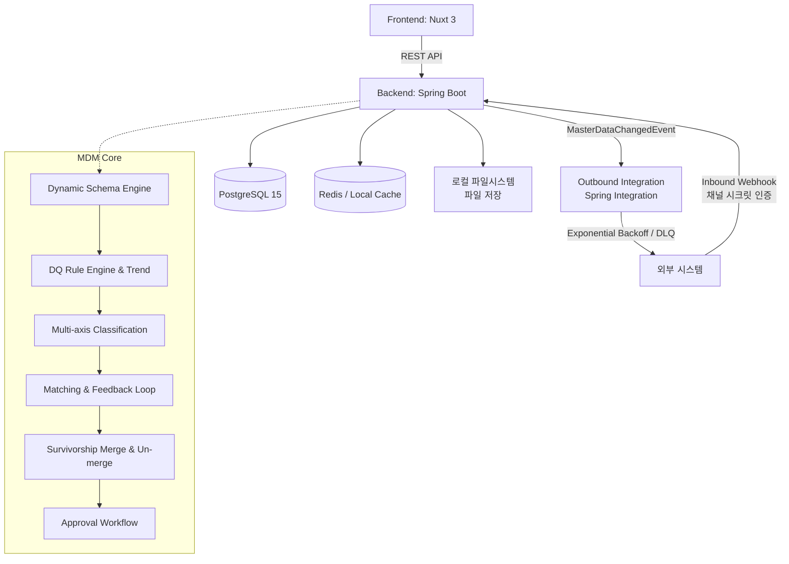

# Master Data Management (MDM) System

이 프로젝트는 조직 내 흩어진 핵심 데이터(Master Data)를 통합, 정제, 일관성 있게 관리하기 위한 Domain / Master Data Management(MDM) 시스템입니다.

## 🎯 Project Purpose (프로젝트 전체 목표)
초기에는 각 부서나 시스템별로 파편화된 **Domain Management** 기능을 제공하여 개별 데이터를 관리하는 수준에서 시작했습니다. 하지만 궁극적인 목표는 **Master Data Management(MDM) 플랫폼으로의 진화**입니다.
기업의 핵심 데이터인 Customer, Product, Vendor, Employee 등의 마스터 데이터를 중앙 집중식으로 수집하고, 데이터 품질(Data Quality)을 검증하여, 중복을 제거한 **Golden Record**를 생성하고 이를 외부 시스템으로 전파하는 것을 목표로 합니다.

> **현재 상태:** 동적 스키마(승인 워크플로우 포함), DQ 룰 엔진(실시간 차단 + 정기 스캔 + 시계열 트렌드), 정확/퍼지(유사도) 중복 검사 및 스튜어드 피드백 루프, 소스 우선순위 기반 필드 단위 병합(Survivorship) 및 Un-merge(병합 해제), 다축 분류체계(Multi-axis Classification), Excel 대량 업로드 사전 검증 리포트, 인바운드/아웃바운드 지수 백오프 및 Dead-Letter Queue(DLQ) 연계까지 완벽하게 구현되어 있습니다. 세부 내용은 [🔑 Key Features](#-key-features) 참고.

## 🏛 Architecture Overview
Frontend와 Backend가 완전히 분리된 구조로 REST API를 통해 통신하며, 런타임에 동적으로 스키마를 구성하는 메타데이터 드리븐 아키텍처를 채택했습니다.



> **보안 및 인프라 안내:** 
> - 백엔드는 Spring Security 기반 자체 JWT 토큰 인증 방식을 사용합니다.
> - `application.yml`은 `JWT_SECRET`, `DB_USERNAME`, `DB_PASSWORD` 등 환경변수를 필수로 참조합니다.
> - Redis 미설치 환경에서는 `LocalCacheConfig`를 통해 인메모리 캐시로 자동 전환됩니다.

## 🛠 Tech Stack 상세
- **Frontend**
  - **Framework**: Nuxt 3 (^3.17.7), Vue 3
  - **Language**: TypeScript (^5.9.3)
  - **UI Library**: Vuestic UI (^1.10.3), TailwindCSS
  - **Data Grid & Chart**: AG Grid Vue3 / Enterprise (^34.3.1), Apache ECharts (^5.6.0)
  - **i18n**: @nuxtjs/i18n (한국어 기본, 영어 지원)
- **Backend**
  - **Framework**: Spring Boot 4.1.0
  - **Language**: Java 17
  - **ORM**: Spring Data JPA, Hibernate, Spring Data Envers
  - **Security**: Spring Security, 자체 발급 JWT (jjwt) — 환경변수(`JWT_SECRET`) 필수 참조
  - **Integration**: Spring Integration, Spring Retry, Spring Kafka, Spring AMQP(RabbitMQ) — 아웃바운드 연계 채널용
- **Database & Infrastructure**
  - **RDBMS**: PostgreSQL 15
  - **Cache**: Redis / Spring Cache (`@Cacheable`, `@CacheEvict`) — Redis 장애 시 Local ConcurrentMap으로 자동 폴백
  - **Container**: Docker & Docker Compose

## 📌 [Roadmap / 향후 확장 예정 인프라]
- **Keycloak**: 외부 IAM (OAuth2 / OIDC) 로그인 연동 준비 중
- **MinIO**: 오브젝트 스토리지 첨부파일 관리 도입 예정
- **Elasticsearch/OpenSearch**: 다중 필드 조합 전문 검색 엔진 도입 검토

## 🚀 Quick Start

### 1. 환경 변수 설정
최상위 디렉토리의 `.env.example`을 복사하여 `.env` 파일을 작성합니다.
```bash
cp .env.example .env
```

### 2. 인프라 실행 (Docker Compose)
```bash
docker-compose up -d
```

### 3. 백엔드 서버 구동
```bash
cd backend
export JWT_SECRET="your_jwt_secret_key_which_must_be_at_least_256_bits_long_for_hs256_security"
export DB_USERNAME="postgres"
export DB_PASSWORD="your_postgres_password_here"
./mvnw clean spring-boot:run
```

### 4. 프론트엔드 서버 구동
```bash
cd frontend
npm install
npm run dev
```

## 🔑 Key Features

**[핵심 구현 완료 기능]**
- **Dynamic Domain / Schema Engine**: 하드코딩된 테이블 스키마 없이 Domain → Classification Node(트리, 필드 상속) → FieldGroup/Sector → FieldDefinition을 런타임에 동적으로 구성.
- **다축 분류체계 (Multi-axis Classification)**: 단일 트리 구조를 넘어, 도메인별 다중 분류축(`ClassificationAxis`: 예: 조직/부서 축, 직군 축, 카테고리 축) 관리 및 레코드 서브 노드 매핑(`RecordSecondaryNode`) 지원.
- **Data Quality Rule Engine & 시계열 트렌드**: NotNull, Regex, Range, Length, Enum, DateRange, CrossField, Unique, SpEL 수식 검증. 기안/수정 시 실시간 차단(hard-block), 크론 스케줄 스캔 + `DqScoreSnapshot` 기반 DQ 점수/위반 시계열 트렌드 시각화(`dq-dashboard.vue`).
- **Excel 대량 업로드 사전 검증 리포트**: Excel 파일 업로드 시 `POST /records/batch-validate` 사전 검증을 거쳐, 행별 위반 필드·사유·입력값을 표로 리포팅하고 유효한 행만 선택하여 결재 상신 가능 (`ExcelUploader.vue`).
- **Matching / 중복 검사 & 피드백 루프**: 정확(EXACT) 및 퍼지(FUZZY) 매칭. 스튜어드의 매칭 검토 이력(`CONFIRMED_MERGE`, `REJECTED`)을 통계 분석하여 `similarityThreshold` 권장 조정을 제공하는 피드백 루프 API 구현 (`MatchFeedbackService`).
- **Golden Record 병합 & Un-merge (병합 해제)**: 소스 시스템 우선순위(`SourcePriority`) 기반 필드 단위 서바이버십 병합 및 출처 기록(`RecordFieldSource`). 잘못 병합된 레코드를 복원하는 **Un-merge API**(`POST /api/records/{id}/unmerge`) 및 UI 버튼 지원.
- **연계(Integration) 지수 백오프 & Dead-Letter Queue (DLQ)**: 연계 실패 시 지수 백오프($2^{retryCount}$)에 따른 자동 재시도 시각 계산, 1분 주기 스케줄러 자동 재시도(`IntegrationRetryScheduler`), 최대 재시도 초과 건 `DEAD_LETTER` 격리 큐 전환 및 수동/일괄 재시도 API 제공.
- **EffectiveFields 캐싱 & 스키마 무효화**: `@Cacheable` 기반 유효 필드 수집 결과 캐싱 및 스키마 변경 시 `@CacheEvict` 자동 무효화. Redis 부재 시 In-Memory 로컬 캐시 자동 작동.
- **Record 승인 워크플로우 & 감사(Audit)**: 레코드 다단계 결재(DRAFT, PENDING_APPROVAL, APPROVED, REJECTED), `RecordHistory` 버전 관리 및 `SchemaHistory` 스냅샷 이력.

## 🧪 Testing
백엔드는 JUnit 5 기반으로 서비스, 컨트롤러, 엔티티 단위 테스트(47개 이상 클래스)가 완벽하게 구축되어 있습니다.
```bash
cd backend
./mvnw test
```

## 📚 Data Model 개요
시스템은 동적 도메인 메타데이터 구조를 사용합니다.

1. **Domain**: 최상위 마스터 데이터 도메인. Identifier Field 및 Display Name Field 지정 필수.
2. **ClassificationAxis**: 도메인 하위의 분류 축 (예: 조직 축, 직군 축). 기본 축 및 서브 축 지원.
3. **ClassificationNode**: 분류축 하위의 분류 트리 노드. 상위 노드의 필드가 하위 노드로 자동 상속됨.
4. **RecordSecondaryNode**: 레코드가 기본 노드 외 타 분류축 노드에도 동시 등록되는 다대다 매핑 엔티티.
5. **Sector & Group**: 입력을 구성하는 탭(Sector) 및 필드 그룹(FieldGroup).
6. **Field (FieldDefinition)**: 데이터 항목 정의. 텍스트, 숫자, 날짜, 선택, 다국어, 파일, 참조 타입 지원.
7. **Record & Approval**: 생성/수정/삭제 요청이 `ApprovalRequest`를 거쳐 `Record`로 버전 관리 및 활성화.
8. **DqRule / DqViolation / DqScoreSnapshot**: 품질 규칙, 위반 기록, 시계열 품질 점수 스냅샷.
9. **MatchingRule / MatchCandidate**: 중복 검사 규칙, 후보 목록 및 스튜어드 피드백 통계.
10. **IntegrationChannel / IntegrationLog**: 연계 채널 설정, 백오프 정책, DLQ 연계 이력.

## 🌐 API Base URL & 주요 Endpoint
- **Base URL**: `http://localhost:8080/api`

| 구분 | Method & Path | 설명 |
|---|---|---|
| 도메인/스키마 | `GET /domains` | 도메인 목록 조회 |
| 도메인/스키마 | `POST /domains` | 신규 도메인 생성 |
| 분류축 | `GET /domains/{domainId}/axes` | 도메인 분류축 목록 조회 |
| 분류축 | `POST /domains/{domainId}/axes` | 신규 분류축 생성 |
| 데이터 품질 | `GET /domains/{domainId}/dq-score` | 도메인 현재 DQ 점수 조회 |
| 데이터 품질 | `GET /domains/{domainId}/dq-score/trend` | DQ 점수 시계열 트렌드 조회 |
| 데이터 품질 | `POST /domains/{domainId}/dq-scan` | 도메인 레코드 DQ 전체 스캔 및 스냅샷 기록 |
| 매칭/피드백 | `GET /domains/{domainId}/matching-rules/feedback-summary` | 매칭 규칙 피드백 통계 및 권가 임계값 조회 |
| 레코드 | `POST /nodes/{nodeId}/records` | 레코드 생성 요청 (결재 기안) |
| 레코드 | `POST /nodes/{nodeId}/records/batch-validate` | Excel 대량 업로드 행 단위 사전 DQ 검증 |
| 레코드/병합 | `POST /records/{id}/unmerge` | 병합된 레코드 Un-merge (원복) |
| 레코드/다축 | `GET/POST /records/{id}/secondary-nodes` | 레코드 서브 분류축 노드 매핑 조회/설정 |
| 결재 | `GET /approval-requests/todos` | 내 결재함(대기 목록) 조회 |
| 연계/DLQ | `GET /admin/integration/logs/dead-letter` | Dead-Letter Queue 연계 실패 로그 조회 |
| 연계/DLQ | `POST /admin/integration/logs/dead-letter/retry-all` | Dead-Letter Queue 전체 일괄 재시도 |

## 🤝 Contributing
기여 방법, 브랜치 전략, 커밋 규약 등은 [`CONTRIBUTING.md`](./CONTRIBUTING.md)를 참고해 주세요.
