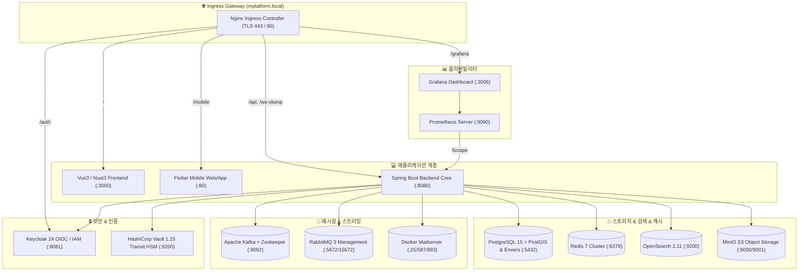

# 🏢 Master Data Management (MDM) Enterprise Platform
# 📘 시스템 운영 및 아키텍처 매뉴얼 (Enterprise Operation Guide)

본 문서는 엔터프라이즈 마스터 데이터 관리(MDM) 플랫폼의 **인프라 배포, 13대 미들웨어 운영, 보안/키 관리, 데이터 백업 및 재해 복구(DR), 모니터링 및 Swagger API 명세 활용법**을 상세히 정리한 공식 운영 가이드북입니다.

---

## 1. 🏗️ 시스템 아키텍처 및 13대 파드/미들웨어 맵

MDM 플랫폼은 쿠버네티스(Kubernetes) 및 도커(Docker) 기반의 분산 마이크로서비스 및 미들웨어 클러스터로 구성되어 있습니다.



### 13대 파드 / 미들웨어 포트 매핑표

| # | 컴포넌트 | 내부 포트 | 호스트/외부 포트 | 프로토콜 | 용도 및 상태 점검 엔드포인트 |
|---|---|---|---|---|---|
| **1** | **Backend** | `8080` | `8080` | HTTP/WS | Spring Boot 코어 API & STOMP (`/api/actuator/health`) |
| **2** | **Frontend** | `3000` | `3000` | HTTP | Nuxt 3 웹 프론트엔드 UI (`/login`) |
| **3** | **Mobile** | `80` | `8082` | HTTP | Flutter 반응형 웹 클라이언트 (`/mobile/`) |
| **4** | **Keycloak** | `8080` | `8081` | HTTP | OIDC / OAuth2 인증 및 RBAC (`/realms/mplatform/...`) |
| **5** | **Vault** | `8200` | `8200` | HTTP | HashiCorp Transit 암호화 엔진 (`/v1/sys/health`) |
| **6** | **PostgreSQL** | `5432` | `5432` | TCP | PostGIS 공간 DB & Hibernate Envers 불변 감사 원장 |
| **7** | **Redis** | `6379` | `6379` | TCP | 분산 캐시 (Local In-Memory Failover 지원) |
| **8** | **OpenSearch** | `9200` | `9200` | HTTP | 한글 Nori 형태소 분석 및 전역 초고속 검색 (`/_cluster/health`) |
| **9** | **MinIO** | `9000/9001`| `9000/9001`| HTTP | S3 호환 첨부파일 & 대용량 콜드 아카이브 (`/minio/health/live`)|
| **10**| **Kafka** | `9092` | `9092` | TCP | 실시간 CDC 변경 스트리밍 버스 |
| **11**| **RabbitMQ** | `5672/15672`| `5672/15672`| AMQP/HTTP| 비동기 메시지 큐 & 관리 콘솔 (`/api/overview`) |
| **12**| **Prometheus**| `9090` | `9090` | HTTP | 메트릭 수집 및 시계열 TSDB (`/-/healthy`) |
| **13**| **Grafana** | `3000` | `3005` | HTTP | 시스템 리소스 및 성능 시각화 대시보드 (`/api/health`) |

---

## 2. 🚀 배포 및 환경 구동 가이드 (Deployment & Operations)

### 2.1 쿠버네티스 (K8s Minikube / Production) 배포
K8s 클러스터 배포 시 `k8s/` 매니페스트 파일들을 순서대로 적용합니다.

```powershell
# 1. Namespace 및 ConfigMap, Secret, PVC 생성
kubectl apply -f c:\dev\ai\k8s\00-namespace.yaml
kubectl apply -f c:\dev\ai\k8s\01-config.yaml
kubectl apply -f c:\dev\ai\k8s\02-pvc.yaml
kubectl apply -f c:\dev\ai\k8s\03-tls-secret.yaml

# 2. 데이터베이스 & 미들웨어 파드 기동
kubectl apply -f c:\dev\ai\k8s\10-postgres.yaml
kubectl apply -f c:\dev\ai\k8s\11-opensearch.yaml
kubectl apply -f c:\dev\ai\k8s\12-minio.yaml
kubectl apply -f c:\dev\ai\k8s\13-rabbitmq.yaml
kubectl apply -f c:\dev\ai\k8s\14-kafka-zookeeper.yaml
kubectl apply -f c:\dev\ai\k8s\15-keycloak.yaml
kubectl apply -f c:\dev\ai\k8s\16-redis.yaml
kubectl apply -f c:\dev\ai\k8s\17-vault.yaml
kubectl apply -f c:\dev\ai\k8s\18-mailserver.yaml

# 3. 모니터링 & 애플리케이션 서비스 기동
kubectl apply -f c:\dev\ai\k8s\20-prometheus.yaml
kubectl apply -f c:\dev\ai\k8s\21-grafana.yaml
kubectl apply -f c:\dev\ai\k8s\30-backend.yaml
kubectl apply -f c:\dev\ai\k8s\31-frontend.yaml
kubectl apply -f c:\dev\ai\k8s\32-mobile.yaml
kubectl apply -f c:\dev\ai\k8s\40-ingress.yaml

# 4. 배포 롤아웃 상태 확인
kubectl get pods -n mdm-system -o wide
```

### 2.2 원클릭 빌드 & 무중단 롤아웃 (`deploy.ps1`)
소스 코드 수정 후 새로운 컨테이너 이미지를 빌드하여 무중단 롤아웃을 수행합니다.
```powershell
powershell -ExecutionPolicy Bypass -File c:\dev\ai\deploy.ps1
```

---

## 3. 🔒 보안, 인증 및 암호화 키 수명주기 (Security & Key Management)

### 3.1 Keycloak IAM / OIDC 설정
- **기본 Realm**: `mplatform`
- **웹 클라이언트**: `mdm-frontend` (Public Client, PKCE 지원)
- **모바일 클라이언트**: `mdm-mobile` (OIDC PKCE 인증 흐름)
- **동시 세션 제어**: 단일 계정 다중 로그인 감지 시 이전 세션 자동 만료 및 알림 전파

### 3.2 HashiCorp Vault Transit HSM 암호화
- **Transit Secret Engine**: `sys/mounts/transit`
- **마스터 암호화 키**: `mdm-field-key` (AES-256-GCM96)
- **키 로테이션 (Key Rotation) 절차**:
  ```bash
  # Vault CLI 또는 REST API를 통한 키 버전 업그레이드
  curl -H "X-Vault-Token: root" -X POST http://localhost:8200/v1/transit/keys/mdm-field-key/rotate
  ```
  - 새 데이터는 최신 버전 키로 암호화되며, 구버전 데이터는 백그라운드 재암호화(`rewrap`)를 통해 안전하게 유지됩니다.

### 3.3 제로 트러스트 하이브리드 암호화 & Blind Indexing
- **민감 필드 암호화**: 32바이트 AES 대칭키 또는 Vault Transit을 통해 필드 레벨 암호화 수행.
- **HMAC Blind Index**: 검색 성능 및 보안을 위해 원본 평문을 복호화하지 않고 `SHA-256 HMAC` 블라인드 인덱스를 생성하여 일치 검색(Exact Search)을 지원.

---

## 4. 🗄️ 데이터 거버넌스, 백업 및 재해 복구 (Backup & DR)

### 4.1 PostgreSQL 데이터베이스 백업
```bash
# 전체 스키마 및 Envers 감사 이력 덤프 (일일 크론 권장)
pg_dump -h localhost -p 5432 -U postgres -d domain_db -F c -b -v -f "/backup/mdm_db_$(date +%Y%m%d).dump"
```
> [!CAUTION]
> 데이터 정리 또는 유지보수 시 절대로 `TRUNCATE TABLE` 명령어를 사용하지 마십시오. 데이터 무결성과 Envers 감사 체인 보존을 위해 반드시 도메인/레코드 단위 개별 삭제(Soft/Hard Delete)를 수행해야 합니다.

### 4.2 MinIO 오브젝트 스토리지 백업
```bash
# MinIO Client(mc)를 이용한 첨부파일 및 콜드 아카이브 백업
mc mirror mdm-minio/mdm-attachments /backup/minio-attachments/
```

---

## 5. 📊 모니터링, 옵저버빌리티 및 장애 대응 SOP

### 5.1 주요 모니터링 지표 (Prometheus & Grafana)
- **JVM & GC**: `jvm_memory_used_bytes`, `jvm_gc_pause_seconds_sum`
- **HikariCP 커넥션 풀**: `hikaricp_connections_active`, `hikaricp_connections_idle`, `hikaricp_connections_pending`
- **HTTP 요청 지연 및 에러율**: `http_server_requests_seconds_count`, `http_server_requests_seconds_max` (p95, p99)
- **메시지 큐 대기열**: `rabbitmq_queue_messages`, `kafka_consumergroup_lag`

### 5.2 장애 대응 시나리오 (SOP)
1. **Redis 캐시 다운 시**:
   - 백엔드의 하이브리드 캐시(`LocalCacheConfig`)가 즉시 감지하여 로컬 인메모리 `ConcurrentMap`으로 무중단 자동 전환됩니다.
   - 조치: `kubectl restart deployment redis -n mdm-system`
2. **Kafka / 외부 연계 파이프라인 지연 시**:
   - `ExponentialBackOff` 및 DLQ(Dead Letter Queue)가 비정상 메시지를 격리하여 메인 트랜잭션을 보호합니다.
   - 조치: 관리자 화면 `통합 연계 관리 > 채널 모니터링`에서 DLQ 재처리 클릭.
3. **이상 탐지 레이더 경보 발생 시**:
   - `VolumeAnomalyRadar` 또는 `AnomalyAccessDetection`에서 대량 데이터 변동이나 비인가 마스킹 해제 탐지 시 실시간 슬랙/웹훅 및 시스템 알림이 전파됩니다.

---

## 6. 📖 Swagger UI 및 OpenAPI 3.0 API 카탈로그 활용

본 플랫폼은 Springdoc OpenAPI 3.0 기반의 자동화된 대화형 API 문서를 제공합니다.

### 6.1 접속 URL
- **Swagger UI 웹 인터페이스**:
  - Ingress Gateway: [`https://mplatform.local/api/swagger-ui.html`](https://mplatform.local/api/swagger-ui.html)
  - 로컬 개발 환경: [`http://localhost:8080/api/swagger-ui.html`](http://localhost:8080/api/swagger-ui.html)
- **OpenAPI v3 JSON 명세서**:
  - [`https://mplatform.local/api/v3/api-docs`](https://mplatform.local/api/v3/api-docs)

### 6.2 4대 API 그룹 분할
1. `00-all-apis`: 전사 전체 REST 엔드포인트
2. `01-core-mdm`: 동적 도메인(`Domain`), 분류체계(`ClassificationNode`), 다축(`Axis`), 필드 정의(`FieldDefinition`), 레코드 CRUD
3. `02-dq-governance`: 데이터 품질 규칙(`DQ`), AI 자율 치유, 골든 레코드 매칭(`Matching`), 서바이버십 병합/언머지, 전자 결재(`Approval`)
4. `03-platform-collaboration`: 인증(`Auth`), 사용자/조직 관리, 공통코드, 메뉴, 실시간 메신저(`Chat`), 사내 편지함(`Inbox`), 외부 연계 채널(`Integration`)

### 6.3 Swagger UI 토큰 인증 테스트 방법
1. 우측 상단의 **`Authorize` (자물쇠)** 버튼을 클릭합니다.
2. Value 필드에 Keycloak 또는 백엔드 로그인 시 발급받은 JWT Access Token을 입력합니다 (형식: `Bearer eyJhbGci...` 또는 `eyJhbGci...`).
3. **`Authorize`** $\rightarrow$ **`Close`** 후 원하는 API 엔드포인트를 선택하여 **`Try it out`**으로 실시간 테스트를 수행합니다.
