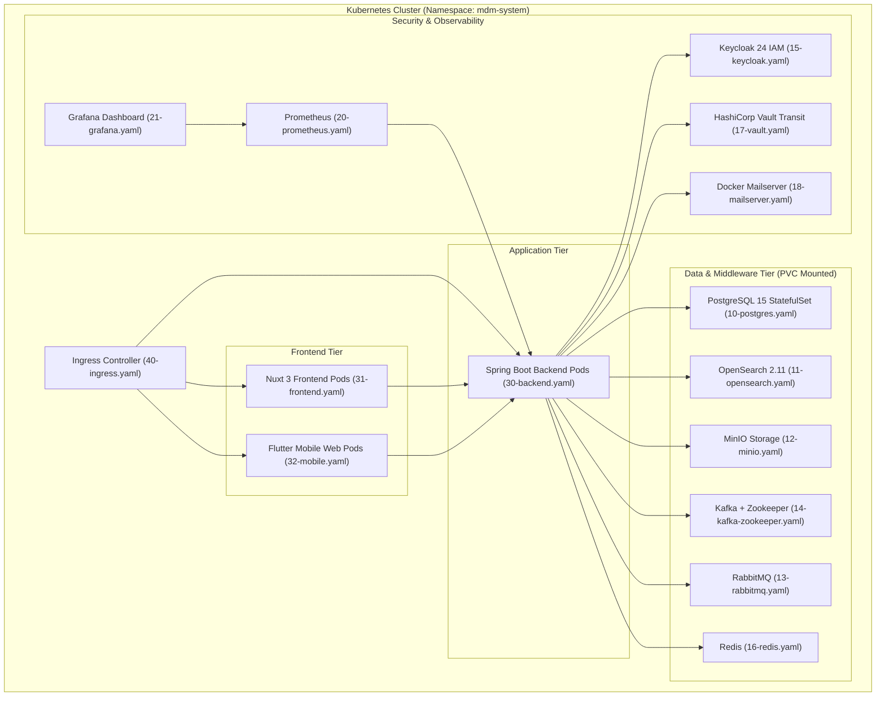

# 10. 인프라, 쿠버네티스 배포 & 모니터링 가이드 (Infrastructure & Deployment)

본 문서는 플랫폼의 Docker Compose 로컬 인프라, Kubernetes(19개 매니페스트) 프로덕션 배포, HashiCorp Vault Transit 연동, Prometheus/Grafana 통합 관제, 그리고 CI/CD 파이프라인에 대한 상세 기술 명세서이다.

---

## 10.1 인프라 아키텍처 개요



---

## 10.2 Kubernetes 매니페스트 구성 (`k8s/`)

프로젝트 최상단의 `k8s/` 디렉토리에 19종의 쿠버네티스 매니페스트가 완비되어 있습니다.

| 파일명 | 종류 | 역할 및 설정 내용 |
|---|---|---|
| `00-namespace.yaml` | Namespace | 전용 네임스페이스 `mdm-system` 정의 |
| `01-config.yaml` | ConfigMap / Secret | DB 연결정보, JWT 시크릿, Keycloak 및 Vault 연동 설정 |
| `02-pvc.yaml` | PersistentVolumeClaim | PostgreSQL, MinIO, Vault, OpenSearch, Mail용 영구 볼륨 |
| `03-tls-secret.yaml` | Secret | Mail 및 Ingress SSL/TLS 인증서 및 비공개 키 Secret |
| `10-postgres.yaml` | StatefulSet / Service | PostgreSQL 15 (PostGIS) 데이터베이스 |
| `11-opensearch.yaml`| Deployment / Service | OpenSearch 2.11 전문 검색 엔진 (9200 포트) |
| `12-minio.yaml` | Deployment / Service | MinIO S3 호환 오브젝트 스토리지 (9000, 9001 콘솔) |
| `13-rabbitmq.yaml` | Deployment / Service | RabbitMQ 3 AMQP 브로커 (5672, 15672 관리콘솔) |
| `14-kafka-zookeeper.yaml` | StatefulSet / Service | Confluent Kafka 7.5 + Zookeeper 이벤트 스트리밍 |
| `15-keycloak.yaml` | Deployment / Service | Keycloak 24 IAM 인증 서버 (Realm 자동 임포트) |
| `16-redis.yaml` | Deployment / Service | Redis 캐시 서버 (6379 포트) |
| `17-vault.yaml` | StatefulSet / Service | HashiCorp Vault 1.15 Transit 암호화 엔진 |
| `18-mailserver.yaml` | Deployment / Service | Docker Mailserver (SMTP, IMAP, SMTPS, IMAPS 메일 서비스) |
| `20-prometheus.yaml`| Deployment / Service | Prometheus 메트릭 수집 엔진 (Actuator 스크랩) |
| `21-grafana.yaml` | Deployment / Service | Grafana 모니터링 대시보드 (사전 프로비저닝) |
| `30-backend.yaml` | Deployment / Service | Spring Boot 백엔드 애플리케이션 (JVM 옵션, 헬스체크) |
| `31-frontend.yaml` | Deployment / Service | Nuxt 3 프론트엔드 웹 콘솔 (Node.js SSR) |
| `32-mobile.yaml` | Deployment / Service | Flutter 모바일 웹 클라이언트 (Nginx 서빙, 80 포트) |
| `40-ingress.yaml` | Ingress | NGINX Ingress 라우팅 (SSL/TLS 종료, Path 라우팅) |

### K8s 배포 실행 가이드:
```bash
# 네임스페이스 및 기본 설정 적용
kubectl apply -f k8s/00-namespace.yaml
kubectl apply -f k8s/01-config.yaml
kubectl apply -f k8s/02-pvc.yaml
kubectl apply -f k8s/03-tls-secret.yaml

# 미들웨어 및 데이터베이스 배포
kubectl apply -f k8s/10-postgres.yaml
kubectl apply -f k8s/11-opensearch.yaml
kubectl apply -f k8s/12-minio.yaml
kubectl apply -f k8s/13-rabbitmq.yaml
kubectl apply -f k8s/14-kafka-zookeeper.yaml
kubectl apply -f k8s/15-keycloak.yaml
kubectl apply -f k8s/16-redis.yaml
kubectl apply -f k8s/17-vault.yaml
kubectl apply -f k8s/18-mailserver.yaml

# 모니터링 배포
kubectl apply -f k8s/20-prometheus.yaml
kubectl apply -f k8s/21-grafana.yaml

# 애플리케이션 및 인그레스 배포
kubectl apply -f k8s/30-backend.yaml
kubectl apply -f k8s/31-frontend.yaml
kubectl apply -f k8s/32-mobile.yaml
kubectl apply -f k8s/40-ingress.yaml
```

---

## 10.3 배포 및 이미지 빌드 자동화 스크립트 (`deploy.sh`, `publish-docker.sh`)

MPlatform은 멀티 컨테이너 서비스(Backend, Frontend, Mobile)의 빌드 및 쿠버네티스 롤아웃을 신속하고 재현 가능하게 수행하기 위한 표준화된 자동화 스크립트를 제공합니다.

> [!NOTE]
> **PowerShell 스크립트 제거 안내**:
> 이전 버전에 존재하던 Windows 전용 PowerShell 스크립트(`deploy.ps1`, `publish-docker.ps1`)는 크로스플랫폼(Linux, macOS, CI/CD 러너) 호환성 보장 및 운영 환경의 일관성을 위해 완전히 제거되었습니다. 현재는 표준 Bash 스크립트(`deploy.sh`, `publish-docker.sh`)만 유지 및 사용됩니다.

### 1. Docker 이미지 빌드 & 퍼블리시 (`publish-docker.sh`):
Backend(Spring Boot), Frontend(Nuxt 3), Mobile(Flutter Web) 3개 컴포넌트를 지정된 레지스트리에 일괄/개별 빌드 및 푸시합니다.
```bash
# 기본 사용법: ./publish-docker.sh [REGISTRY] [TAG] [TARGET]

# 1) 전체 서비스 v1.1.0 빌드 및 레지스트리(GHCR) 푸시
./publish-docker.sh ghcr.io/myorg v1.1.0 all

# 2) 특정 서비스만 빌드 및 푸시 (예: backend, frontend, mobile)
./publish-docker.sh ghcr.io/myorg v1.1.0 backend
./publish-docker.sh ghcr.io/myorg v1.1.0 frontend
./publish-docker.sh ghcr.io/myorg v1.1.0 mobile

# 3) 환경 변수를 통한 빌드 제어 (푸시 없이 로컬 이미지 빌드)
PUSH=false ./publish-docker.sh mplatform 1.1.0 all
```

### 2. Kubernetes 원클릭 배포 & 롤아웃 (`deploy.sh`):
전체 19종 K8s 매니페스트를 적용하고 원격 레지스트리의 최신 이미지 태그를 주입한 뒤 롤아웃 상태를 자동 검증합니다.
```bash
# 기본 사용법: ./deploy.sh [REGISTRY] [TAG]

# v1.1.0 버전으로 K8s 배포 및 롤아웃 갱신
./deploy.sh ghcr.io/myorg v1.1.0

# 로컬 클러스터 매니페스트 기본 적용
./deploy.sh
```

---

## 10.4 HashiCorp Vault Transit 연동 및 초기화

HashiCorp Vault는 데이터 필드 암호화 키를 중앙 집중적으로 관리하며 Transit Secret Engine을 통해 안전한 암호화/복호화 API를 제공합니다.

### Vault Transit 초기화 (`init-vault.sh`):
```bash
#!/bin/bash
export VAULT_ADDR="http://localhost:8200"
export VAULT_TOKEN="root"

# 1. Transit Secret Engine 활성화
vault secrets enable transit

# 2. MDM 필드 암호화 전용 대칭키 생성 (aes256-gcm96)
vault write -f transit/keys/mdm-field-key type=aes256-gcm96

# 3. K8s ServiceAccount 인증 설정 (쿠버네티스 환경)
vault auth enable kubernetes
vault write auth/kubernetes/config \
    kubernetes_host="https://kubernetes.default.svc"
```

---

## 10.5 Prometheus & Grafana 관제 지표

- **수집 대상 엔드포인트**: `http://<backend>:8080/actuator/prometheus`
- **핵심 모니터링 메트릭**:
  - `http_server_requests_seconds_count` / `_max`: 엔드포인트별 요청 처리량 및 응답 지연 (p95, p99).
  - `jvm_memory_used_bytes` / `jvm_memory_max_bytes`: JVM Heap / Non-Heap 메모리 사용률.
  - `jvm_gc_pause_seconds_sum`: GC 정지 시간.
  - `hikaricp_connections_active` / `_idle` / `_pending`: DB 커넥션 풀 상태.
  - `process_cpu_usage` / `system_cpu_usage`: CPU 사용률.

---

## 10.6 CI/CD 파이프라인 (GitHub Actions)

프로젝트 루트의 `.github/workflows/`에 정의된 워크플로우를 통해 지속적 통합 및 배포를 수행합니다:

1. **`ci.yml` (통합 CI 파이프라인)**:
   - PR 및 Push 시 백엔드 JUnit 5 테스트(PostgreSQL 15 Alpine 컨테이너 서비스 연동) 및 프론트엔드 Node.js 24 Vitest + `npm run build` 정적 컴파일을 자동 수행하여 코드 품질과 회귀 결함을 검증.
2. **`docker-publish.yml` (Docker Build & Publish 자동화)**:
   - GitHub Release 게시, `v*.*.*` 태그 푸시(예: `v1.1.0`), 또는 `workflow_dispatch` 수동 실행 시 Backend(`mplatform-backend`), Frontend(`mplatform-frontend`), Mobile(`mplatform-mobile`) 이미지를 빌드하여 GitHub Container Registry(`ghcr.io`)로 버전 태그(`v1.1.0`) 및 `latest` 태그를 자동 푸시.
3. **프로덕션 Docker Compose 운영 (`docker-compose.prod.yml`)**:
   - `DOCKER_REGISTRY` 및 `IMAGE_TAG=1.1.0` 환경 변수를 주입하여 전체 플랫폼 서비스를 일괄 기동.

---

## 10.7 프로덕션 운영 원칙 및 데이터 안전 규약

1. **Hibernate DDL 모드 (`ddl-auto: validate`)**:
   - 프로덕션(`prod`) 환경에서는 테이블 자동 변경이나 삭제를 차단하기 위해 반드시 `validate` 모드로 운영한다.
2. **`TRUNCATE TABLE` 절대 금지**:
   - DB 유지보수 및 테스트 시 기존 데이터를 일괄 삭제하는 `TRUNCATE` 사용을 엄격히 금지하며, 명시적 조건 조회를 통한 개별 삭제(Delete)를 원칙으로 한다.
3. **멱등성 시딩 (Idempotent Seeding)**:
   - 권한, 메뉴, 공통코드 등 기초 데이터 시더는 서버 재시작 시 기존 레코드 카운트를 선 검증(`count() > 0`)하여 중복 실행되지 않도록 멱등성을 보장한다.
