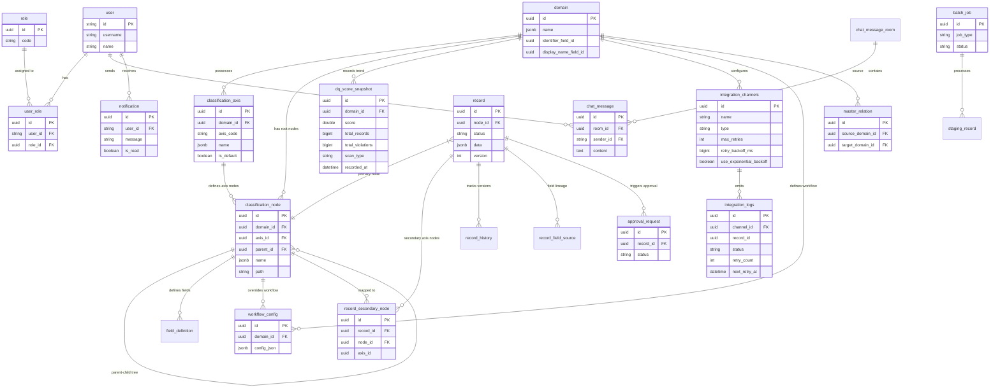

# 5. 주요 시나리오 & ERD

## 5.1 ERD 다이어그램 (Mermaid)

## 5.2 주요 운영 시나리오

1. **다축 분류 체계 등록 및 서브 노드 매핑**:
   - 관리자가 부서 분류축과 직군 분류축을 도메인에 생성.
   - 레코드 생성 시 `node_id`(부서 노드)를 지정하고 `POST /records/{id}/secondary-nodes`를 통해 직군 노드에 서브 매핑.

2. **Excel 사전 검증 업로드**:
   - `POST /records/batch-validate` 사전 검증 API 호출.
   - UI에서 검증 결과 리포트를 확인하고 유효한 행만 선택 업로드.

3. **Golden Record 병합 및 Un-merge 복원**:
   - 중복 감지 시 소스 우선순위에 맞춰 자동 병합 (`source_priority`).
   - 오병합 발생 시 `POST /records/{id}/unmerge`로 원상 복구.

4. **연계 지수 백오프 및 Dead-Letter Queue 처리**:
   - 외부 시스템 연계 장애 시 지수 백오프에 따른 자동 재시도 실행.
   - 최대 재시도 초과 시 DLQ 상태로 전환되어 관리자 전용 대시보드에서 일괄 재시도 수행.

5. **시스템 초기 설치**:
   - `/api/system/install` 엔드포인트를 통한 위저드로 어드민 계정 생성 및 Keycloak Realm 연동 초기화 진행.

6. **사용자/조직 관리**:
   - 관리자가 조직 트리를 생성하고 사용자를 부서에 배치.
   - 사용자에 역할을 할당하고 `DomainPermission`을 통해 도메인 접근 권한을 매핑.

7. **실시간 협업**:
   - 사용자가 STOMP 기반 인앱 메신저에 연결.
   - 채팅방을 생성하고 실시간 메시지를 주고받으며 번역 기능을 통해 글로벌 커뮤니케이션.

8. **모니터링**:
   - Prometheus를 통해 시스템 리소스, 지연 시간(Latency) 등 메트릭 수집.
   - Grafana 대시보드에 실시간 시각화하여 플랫폼 가용성 확인.

9. **대량 데이터 비동기 내보내기**:
   - `AsyncBatchExportService`를 통해 대용량 레코드 엑셀 다운로드 요청.
   - BatchJob의 상태를 폴링하여 완료 시 생성된 파일 링크를 제공.
