# 5. 주요 운영 시나리오 & 통합 ERD (Scenarios & ERD)

---

## 5.1 엔터프라이즈 통합 ERD 다이어그램 (Mermaid)

```mermaid
erDiagram
    %% Core Schema
    domain ||--o{ classification_axis : "defines axes"
    domain ||--o{ classification_node : "contains tree"
    domain ||--o{ sector : "has sectors"
    domain ||--o{ dq_score_snapshot : "tracks score"
    domain ||--o{ dq_scan_schedule : "schedules scan"
    domain ||--o{ matching_rule : "configures matching"
    domain ||--o{ integration_channel : "links integration"
    domain ||--o{ workflow_config : "defines default wf"
    domain ||--o{ master_relation : "connects domains"
    domain ||--o{ business_term : "maps terms"
    domain ||--o{ domain_snapshot : "backups"

    classification_axis ||--o{ classification_node : "groups nodes"
    classification_node ||--o{ classification_node : "parent-child tree"
    classification_node ||--o{ field_definition : "defines dynamic fields"
    classification_node ||--o{ workflow_config : "overrides wf"
    sector ||--o{ field_group : "contains groups"
    field_group ||--o{ field_definition : "organizes fields"

    %% Records & Lineage
    record }|--|| classification_node : "primary node"
    record ||--o{ record_secondary_node : "secondary axis mapping"
    classification_node ||--o{ record_secondary_node : "mapped to"
    record ||--o{ record_history : "tracks version snapshots"
    record ||--o{ record_field_source : "tracks field lineage"
    record ||--o{ record_pipeline_lineage : "5-stage pipeline trace"
    record ||--o{ approval_request : "triggers request"
    record ||--o{ dq_violation : "has violations"

    %% Approval & Governance
    approval_request ||--o{ approval_step : "executes steps"
    approval_request ||--o{ approval_delegation : "delegates"
    approval_routing_template ||--o{ domain : "applies dynamic routing"

    %% Matching & Survivorship
    matching_rule ||--o{ match_candidate : "detects duplicates"
    match_candidate ||--o{ record : "primary & candidate"
    domain ||--o{ survivorship_rule : "defines merge rules"
    domain ||--o{ source_priority : "defines system trust"

    %% Integration & Messaging
    integration_channel ||--o{ integration_log : "records transfer"
    integration_channel ||--o{ webhook_subscription : "emits events"
    batch_job ||--o{ staging_record : "processes bulk data"

    %% Security, Users & RBAC
    user ||--o{ user_role : "assigned"
    role ||--o{ user_role : "contains"
    user ||--o{ two_factor_backup_code : "has backup codes"
    user ||--o{ user_org_history : "org movement history"
    department ||--o{ user : "belongs to"
    organization ||--o{ department : "parent org"
    department ||--o{ team : "sub teams"
    role ||--o{ domain_node_permission : "scoped permission"
    role ||--o{ column_masking_rule : "dynamic masking"
    domain ||--o{ domain_node_permission : "scoped domain"
    user ||--o{ sensitive_data_access_log : "audit logs"
    user ||--o{ domain_access_request : "requests access"
    user ||--o{ domain_permission : "granted"

    %% Collaboration
    chat_message_room ||--o{ chat_message_room_member : "participants"
    chat_message_room ||--o{ chat_message : "contains messages"
    user ||--o{ chat_message : "sends"
    user ||--o{ notification : "receives alerts"

    %% Entity Details
    domain {
        uuid id PK
        jsonb name
        uuid identifier_field_id
        uuid display_name_field_id
    }
    classification_axis {
        uuid id PK
        uuid domain_id FK
        string axis_code
        jsonb name
        boolean is_default
    }
    classification_node {
        uuid id PK
        uuid domain_id FK
        uuid axis_id FK
        uuid parent_id FK
        jsonb name
        string path
    }
    field_definition {
        uuid id PK
        uuid defined_at_node_id FK
        string key
        string type
        boolean is_encrypted
        string masking_pattern
    }
    record {
        uuid id PK
        uuid node_id FK
        string status
        jsonb data
        int version
        string source_system
    }
    record_history {
        uuid id PK
        uuid record_id FK
        int version
        string action
        jsonb data_snapshot
    }
    approval_request {
        uuid id PK
        uuid record_id FK
        string request_type
        string status
        string requester_id
    }
    approval_step {
        uuid id PK
        uuid request_id FK
        int step_order
        string approver_id
        string status
    }
    dq_score_snapshot {
        uuid id PK
        uuid domain_id FK
        double score
        bigint total_records
        bigint total_violations
        datetime recorded_at
    }
    integration_channel {
        uuid id PK
        string name
        string type
        int max_retries
        bigint retry_backoff_ms
    }
    integration_log {
        uuid id PK
        uuid channel_id FK
        string status
        int retry_count
        datetime next_retry_at
    }
```

---

## 5.2 15대 핵심 실무 운영 시나리오

### 시나리오 1: 다축 분류체계 등록 및 레코드 서브 노드 매핑
1. 관리자가 `임직원` 도메인에 기본 분류축(조직도)과 서브 분류축(고용형태, 직군)을 생성한다.
2. 사용자가 신규 임직원을 등록하며 주 분류 노드로 `백엔드팀`을 선택한다.
3. 레코드 상세 화면에서 `POST /records/{id}/secondary-nodes` API를 통해 서브 분류 노드로 `정규직` 및 `엔지니어링`을 등록한다.
4. 다차원 검색 시 조직도 기준뿐만 아니라 '정규직 + 엔지니어링' 조건으로도 해당 레코드가 정확히 조회된다.

### 시나리오 2: Excel 대량 업로드 사전 검증 및 배치 등록
1. 현업 사용자가 수천 건의 고객 데이터가 담긴 Excel 파일을 업로드한다.
2. 프론트엔드가 `POST /records/batch-validate`를 호출하여 DB 저장 없이 행(Row)별 DQ 검증을 수행한다.
3. 검증 리포트 UI(`ExcelUploader.vue`)에 위반 행(예: 이메일 형식 오류, 필수값 누락)이 하이라이트 표시된다.
4. 사용자는 정상 데이터만 선택하거나 엑셀을 수정 후 `POST /records/bulk-import/upload`로 안전하게 비동기 적재를 완료한다.

### 시나리오 3: AI 기반 DQ 룰 추천 및 자율 치료(Remediation)
1. 시스템이 도메인 데이터 프로파일링을 수행하여 데이터 분포와 결측치 패턴을 분석한다.
2. `DqRecommendationService`가 "사업자등록번호 정규식 룰" 및 "연락처 NotNull 룰"을 AI 추천으로 제시한다.
3. 스튜어드가 추천 룰을 승인하면 즉시 DQ 규칙으로 등록된다.
4. 기존 위반 데이터에 대해 `DqRemediationService`가 "전화번호 하이픈 자동 포맷팅" 자율 정제 제안을 생성하고 스튜어드가 원클릭으로 일괄 자동 교정한다.

### 시나리오 4: Golden Record 퍼지 매칭, 피드백 임계값 학습 & Un-merge
1. ERP와 CRM에서 동일 고객('홍길동', '010-1234-5678')이 각각 인입된다.
2. 퍼지 매칭 룰이 Jaro-Winkler 유사도 0.92를 계산하여 `MatchCandidate`로 등록한다.
3. 스튜어드가 후보 목록에서 중복을 확인하고 '중복 확정(`confirm`)'을 클릭한다.
4. 서바이버십 룰(`SourcePriority`: ERP > CRM)에 따라 ERP 필드값을 우선 채택한 골든 레코드가 생성되고 CRM 레코드는 `MERGED` 상태로 변경된다.
5. 차후 오병합으로 판명될 경우 `POST /records/{id}/unmerge`를 호출하여 즉시 두 레코드를 독립된 `ACTIVE` 상태로 완벽 복원한다.

### 시나리오 5: 조건부 동적 라우팅, 결재 위임 및 SLA 에스컬레이션
1. 자산 마스터 데이터 생성 시 거래 금액이 1억 원을 초과하면 `ApprovalRoutingTemplate`에 의해 기본 2단계 결재선에 '재경본부장 승인' 단계가 동적으로 추가된다.
2. 1단계 승인권자인 팀장이 출장 중이므로 `ApprovalDelegation`에 의해 등록된 부팀장에게 결재 알림 및 승인 권한이 자동 위임된다.
3. 2단계 결재가 24시간 동안 처리되지 않자 `ApprovalEscalationService`가 작동하여 상위 본부장에게 결재 단계가 자동 에스컬레이션된다.

### 시나리오 6: 결재 샌드박스 시뮬레이션 및 사전 영향 분석
1. 스튜어드가 핵심 상품 코드의 규격 필드를 수정하는 결재를 상신한다.
2. 승인권자는 결재 전 `POST /approvals/{id}/sandbox-preview`를 실행한다.
3. 가상 샌드박스가 구동되어 해당 변경이 반영될 경우 발생할 수 있는 하위 BOM(자재명세서) 레코드 영향 및 연계 채널 매핑 오류를 사전 리포트로 확인하고 안전하게 승인한다.

### 시나리오 7: 블록체인형 해시체인 원장 생성 및 무결성 검증
1. 레코드가 수정될 때마다 `HashChainAuditService`가 이전 블록 해시와 신규 데이터를 조합하여 SHA-256 해시를 생성한다.
2. 감사관이 `GET /records/{id}/ledger/verify`를 호출하면 제네시스 블록부터 최신 버전까지의 해시 체인을 순차 재계산하여 데이터 위변조가 전혀 없음을 수학적으로 검증한다.

### 시나리오 8: HashiCorp Vault Transit 암호화 & HMAC Blind Index 검색
1. 주민등록번호 필드가 포함된 고객 레코드가 생성된다.
2. 백엔드는 HashiCorp Vault Transit 엔진을 호출하여 주민번호를 HSM 암호화하고, 동시에 검색 전용 HMAC SHA-256 Blind Index 해시를 생성하여 DB에 저장한다.
3. 관리자가 주민번호로 고객을 검색할 때 평문 주민번호의 Blind Index 해시를 계산하여 DB를 대조함으로써, DB 상에 평문이 전혀 존재하지 않는 상태에서 초고속 검색을 완료한다.

### 시나리오 9: 개인정보 마스킹 해제 및 원본 열람 감사(Audit)
1. 일반 화면에서는 고객 주민번호가 `900101-*******`로 마스킹되어 표출된다.
2. 상담원이 업무상 원본 확인이 필요한 경우 '마스킹 해제' 버튼을 누르고 필수 사유(예: "본인 확인 민원 처리")를 입력한다.
3. 서버는 열람자 ID, 접속 IP, 열람 필드, 입력 사유를 `SensitiveDataAccessLog`에 영구 기록한 후 복호화된 원본 데이터를 제공한다.

### 시나리오 10: 연계 지수 백오프 및 Dead-Letter Queue(DLQ) 일괄 복구
1. 외부 ERP 시스템 점검으로 인해 마스터 데이터 아웃바운드 전송이 실패한다.
2. 시스템은 지수 백오프 공식($1\text{s} \to 2\text{s} \to 4\text{s}$)에 따라 3회 자동 재시도한다.
3. 최대 재시도 횟수를 초과한 전송 건은 `DEAD_LETTER` 상태로 격리된다.
4. ERP 점검이 완료된 후 관리자가 DLQ 모니터링 화면에서 `POST /admin/integration/logs/dead-letter/retry-all`을 클릭하여 실패 건들을 전원 정상 재전송한다.

### 시나리오 11: CDC 실시간 스트리밍 & 파이프라인 자가 치유
1. MDM 플랫폼에서 고객의 주소가 변경 완료된다.
2. `CdcStreamingService`가 Kafka 토픽으로 `MasterDataChangedEvent`를 실시간 발행한다.
3. 다운스트림 물류 시스템의 연계 파이프라인에서 네트워크 단절이 감지되면 `PipelineSelfHealingService`가 서킷 브레이커를 작동하고 보조 연계 큐(RabbitMQ)로 트래픽을 자동 우회시켜 데이터 유실을 방지한다.

### 시나리오 12: 레코드 타임머신 As-Of 조회 및 과거 버전 롤백
1. 특정 고객의 데이터가 잘못 수정되어 이전 이력을 확인해야 하는 상황이 발생한다.
2. 사용자가 레코드 타임머신 모달에서 "2026-08-01 15:00" 시점을 지정한다.
3. `RecordTimeMachineService`가 당시의 스냅샷 데이터를 정확히 복원하여 뷰어로 표출하고, 사용자가 '롤백' 버튼을 누르면 과거 버전의 데이터로 즉시 복원된다.

### 시나리오 13: 콜드 스토리지 아카이빙 및 데이터 보존 정책 실행
1. 3년 이상 거래가 없는 휴면 고객 레코드가 보존 기한 정책에 의해 감지된다.
2. `ColdStorageArchiveService`가 해당 레코드들을 압축 패키징하여 MinIO 콜드 스토리지 버킷으로 이관하고 DB에서는 아카이브 상태로 전환하여 메인 DB 성능을 최적화한다.

### 시나리오 14: 자연어 스마트 쿼리 및 비정형 문서 데이터 추출
1. 사용자가 검색창에 "강남구에 위치한 반도체 부품 공급사 중 신용등급 A 이상"을 자연어로 입력한다.
2. `SmartQueryParserService`가 질의를 분석하여 `address: '강남구' AND category: '반도체' AND credit_rating >= 'A'` 조건으로 자동 변환하여 결과를 조회한다.
3. 신규 공급사 등록 시 사업자등록증 PDF를 업로드하면 `UnstructuredDataExtractorService`가 상호, 대표자, 사업자번호를 자동 추출하여 입력 폼을 완성한다.

### 시나리오 15: 실시간 다국어 번역 메신저 및 시스템 라디오 협업
1. 한국 본사 스튜어드와 해외 지사 담당자가 동일 레코드에 대해 인앱 메신저로 실시간 소통한다.
2. 메시지 수신 시 '원클릭 번역' 기능을 통해 한국어/영어가 실시간 상호 번역된다.
3. 관리자는 시스템 라디오 위젯을 통해 전사 공지 배경음악을 방송하며 협업 효율을 극대화한다.

### 시나리오 16: 로그인 이중화 (2FA / OTP) 및 비상 백업코드 복구
1. 보안 관리자가 전사 보안 정책에 따라 임직원 계정에 2FA를 활성화한다.
2. 사용자가 로그인 화면에서 ID/PW를 입력하면 프론트엔드 `TwoFactorVerifyModal`이 트리거된다.
3. 사용자가 스마트폰의 Google Authenticator 앱 6자리 코드를 입력하여 2단계 인증을 완료한다.
4. 만약 스마트폰을 분실한 경우, 최초 등록 시 안전하게 다운로드해 둔 8자리 일회용 긴급 백업코드(예: `A8B9-C1D2`)를 입력하여 정상 로그인하고 사용된 코드는 자동 파기된다.

### 시나리오 17: B2B 셀프 온보딩, ROI 시뮬레이션 및 업종별 템플릿 프로비저닝
1. 잠재 기업 고객이 소개 랜딩 페이지(`https://mdm.mplat.store`)에 접속하여 핵심 아키텍처를 확인한다.
2. ROI 계산기(`/roi-calculator`)에서 자사의 마스터 레코드 수(50만 건)를 입력하고 연간 1억 2천만 원의 데이터 정제 비용 절감 시뮬레이션 결과를 확인한다.
3. '무료 체험 시작' 버튼을 눌러 회원가입 퍼널(`/register`)로 이동하고, 업종으로 '부동산 임대차/자산관리' 템플릿을 선택한다.
4. 백엔드 프로비저닝 엔진이 단일 트랜잭션으로 임대차 계약 도메인, 기본 노드 트리, 15종 필수 필드 및 샘플 계약 데이터를 원클릭으로 자동 생성하여 즉시 업무를 시작할 수 있게 지원한다.

### 시나리오 18: 부동산 임대차 (`LEASE_CONTRACT`) 만기 & 연체 리스크 관제
1. 자산관리 담당자가 MDM 대시보드에 접속한다.
2. '부동산 임대차 리스크 관제 위젯'에서 만기 30일 이내 도래 계약 5건과 7일 이내 만기 임박 1건이 경고 뱃지로 강조 표시된다.
3. 월세 연체 상태(`UNPAID`)로 보증금 차감 리스크가 50%를 초과한 위험 계약을 즉시 클릭하여 상세 내역을 열람하고, 담당 임차인에게 안내장을 발송한다.

### 시나리오 19: 레코드 데이터 계보 (Data Lineage) 전 구간 5단계 감사 추적
1. 특정 제품의 골든 레코드 가격 정보가 예기치 않게 변경되어 데이터 스튜어드가 조사를 시작한다.
2. 레코드 상세 화면에서 '데이터 계보(Data Lineage)' 버튼을 클릭한다.
3. 5단계 파이프라인 그래프(Source Ingestion → DQ Validation → Data Cleansing → Golden Record → Target Egress)가 화면에 렌더링된다.
4. 3단계(Cleansing) 노드를 클릭하여 외부 ERP에서 수신된 원본 값(`1,000,000`)이 어떤 AI 규칙에 의해 정제되었는지 전후 Diff와 처리 시간을 정밀 추적하여 원인을 규명한다.

### 시나리오 20: 도메인/노드 스코프 통제 및 컬럼 수준 동적 마스킹 거버넌스
1. 영남지사 영업 담당자가 시스템에 로그인하여 고객 마스터 레코드 목록을 조회한다.
2. `DomainNodePermission`에 의해 영업본부 하위의 '영남영업팀' 노드에 소속된 고객 레코드만 그리드에 노출되고 타 지사 레코드는 원천 필터링된다.
3. 또한 담당자 역할(`ROLE_SALES`)에 부여된 `ColumnMaskingRule`에 따라 주민등록번호 뒷자리는 `******`, 고객 연소득 컬럼은 `***`로 실시간 동적 마스킹되어 개인정보 유출을 방지한다.

