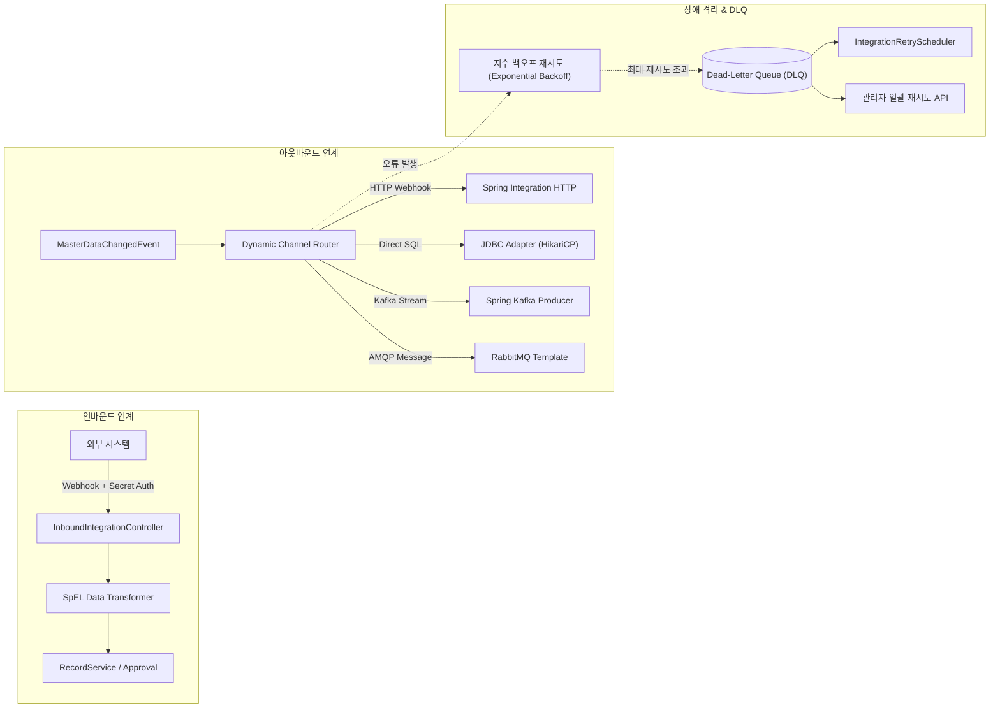

# 7. 외부 연계 (Integration), CDC 스트리밍 & DLQ 명세서

본 문서는 외부 시스템과의 실시간/배치 데이터 연계, CDC 이벤트 스트리밍, 자가 치유 파이프라인 및 Dead-Letter Queue(DLQ)에 대한 상세 기술 명세서이다.

---

## 7.1 연계 채널 (IntegrationChannel) 아키텍처



---

## 7.2 지원 프로토콜 및 세부 구현

### 1. HTTP REST Webhook
- Spring Integration HTTP Outbound Gateway를 통해 RESTful API 호출 수행.
- 커넥션 타임아웃(`5000ms`), 읽기 타임아웃(`10000ms`) 설정 적용.
- Custom Header(Bearer Token, Basic Auth, API Key) 주입 지원.

### 2. JDBC Direct SQL
- MySQL, MariaDB, Oracle, PostgreSQL, MSSQL 등 이기종 RDBMS 직접 SQL 쿼리 실행.
- **보안 & 안정성**:
  - 데이터베이스 접속 자격증명(비밀번호 등)은 AES-256 대칭키로 암호화 저장되며 조회 시 자동 마스킹.
  - 외부 입력 테이블명/컬럼명에 대한 엄격한 식별자 검증 및 DBMS별 Quoting 처리를 통한 SQL Injection 원천 차단.
  - 채널별 전용 `HikariDataSource` 커넥션 풀(최대 5개)을 동적 생성/관리하여 리소스 고갈 방지.

### 3. Apache Kafka (CDC & Event Streaming)
- Spring Kafka Producer를 이용하여 `MasterDataChangedEvent`를 실시간 토픽으로 스트리밍 전송.
- 키 직렬화(`StringSerializer`), 값 직렬화(`JsonSerializer`) 적용 및 안전한 트랜잭션 발행.

### 4. RabbitMQ (AMQP)
- 신뢰성 있는 메시지 큐 전달을 위해 Spring AMQP `RabbitTemplate`을 활용한 메시지 발행 및 승인(Publisher Confirms) 모드 지원.

---

## 7.3 지수 백오프 & Dead-Letter Queue (DLQ) 메커니즘
- **다음 재시도 예정 시각 산출**:
  $$nextRetryAt = now + retryBackoffMs \times 2^{retryCount}$$
- **DLQ 격리 기준**:
  - `retryCount >= maxRetries`에 도달하면 `IntegrationLog`의 상태를 `FAIL`에서 `DEAD_LETTER`로 격리하여 정상 재시도 파이프라인에서 분리한다.
- **자동 & 수동 재시도**:
  - `IntegrationRetryScheduler`가 1분 간격으로 `nextRetryAt`이 지난 `FAIL` 건을 자동 재시도한다.
  - 관리자 전용 API를 통해 DLQ 건들을 수동 개별 또는 전건 일괄 재시도할 수 있다:
    - `GET /api/admin/integration/logs/dead-letter`
    - `POST /api/admin/integration/logs/{logId}/retry`
    - `POST /api/admin/integration/logs/dead-letter/retry-all`

---

## 7.4 인바운드 보안 인증 & API Key 관리
- **Webhook 시크릿 토큰 인증**:
  - 외부 시스템에서 플랫폼으로 데이터를 전송할 때, 채널별로 발급된 고유 시크릿 토큰을 HTTP 헤더(`X-Integration-Secret`)로 전송받아 검증한다.
- **API Key 관리 서비스 (`ApiKeyManagementService`)**:
  - 서드파티 시스템용 연계 API Key를 발급하고, 허용 도메인 및 읽기/쓰기 ACL(Access Control List)을 제어하며 만료일을 관리한다.

---

## 7.5 웹훅 구독 & 디스패처 (`WebhookDispatcherService`)
- 외부 시스템이 특정 이벤트(예: `RECORD_CREATED`, `RECORD_APPROVED`, `MERGE_COMPLETED`)를 구독하면, 이벤트 발생 시 사전 등록된 타겟 URL로 웹훅 페이로드를 비동기 발송한다.

---

## 7.6 CDC 실시간 스트리밍 (`CdcStreamingService`)
- 마스터 데이터 변경 시 변경 전/후 데이터 스냅샷(Before/After), 변경자, 타임스탬프를 포함하는 CDC 메시지를 생성하여 Kafka 및 웹소켓으로 실시간 브로드캐스팅한다.

---

## 7.7 크로스 도메인 동기화 & 파이프라인 자가 치유
- **크로스 도메인 파이프라인 (`CrossDomainSyncPipelineService`)**:
  - '고객' 도메인의 데이터 변경이 '계약' 도메인의 고객 참조 데이터로 자동 전파되는 동기화 파이프라인을 구성한다.
- **파이프라인 자가 치유 (`PipelineSelfHealingService`)**:
  - 연계 파이프라인에서 지속적인 네트워크 단절이나 오류가 감지되면 서킷 브레이커를 작동하고 보조 연계 큐로 트래픽을 자동 우회시켜 데이터 유실을 방지한다.

---

## 7.8 스마트 AI 필드 매핑 (`SmartMappingService`) & SpEL 변환
- **스마트 AI 매핑**:
  - 외부 시스템의 JSON/XML 스키마와 내부 MDM 필드 간 의미론적 유사도를 분석하여 최적의 매핑 규칙을 AI가 자동 추천한다.
- **SpEL 동적 데이터 변환 (`mapping_config_json`)**:
  - 수/발신 페이로드를 Spring Expression Language(SpEL) 기반으로 동적 변환한다:
    ```json
    {
      "customer_no": "#payload.cust_id",
      "full_name": "#payload.first_name + ' ' + #payload.last_name",
      "is_vip": "#payload.total_purchase > 1000000"
    }
    ```

---

## 7.9 대용량 비동기 데이터 처리 (`AsyncBatchExportService`, `BulkImportService`)
- 수십만 건의 대용량 레코드 엑셀 다운로드 요청 시 `AsyncBatchExportService`가 백그라운드에서 청크 단위로 스트리밍 처리 후 MinIO에 업로드하고 다운로드 링크를 알림으로 푸시한다.
- 대용량 임포트 시 `BulkImportService`가 스테이징 테이블(`staging_record`)에 임시 적재 후 유효성 검증을 거쳐 배치 저장한다.
